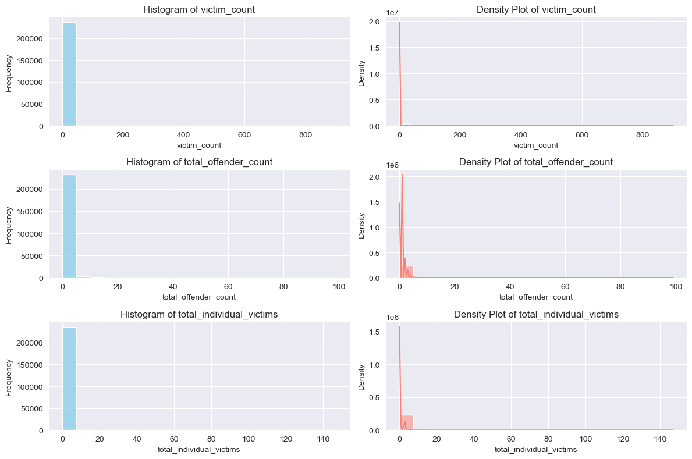
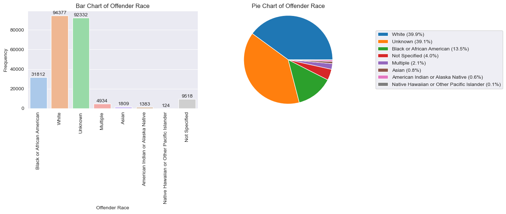
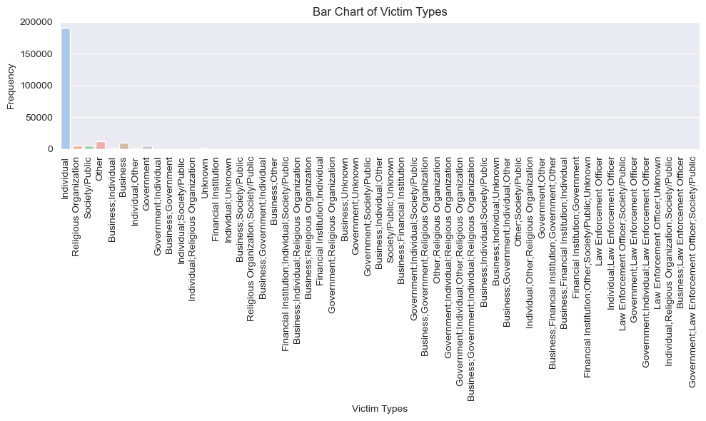
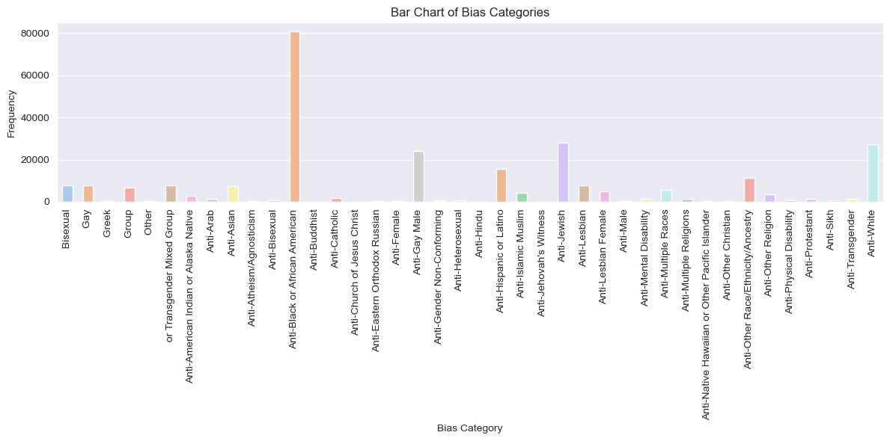
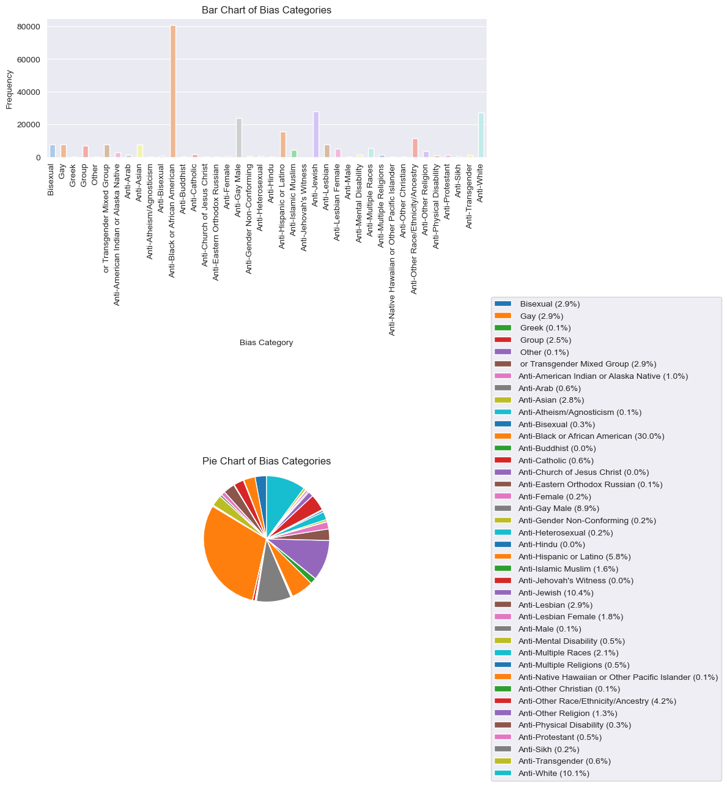
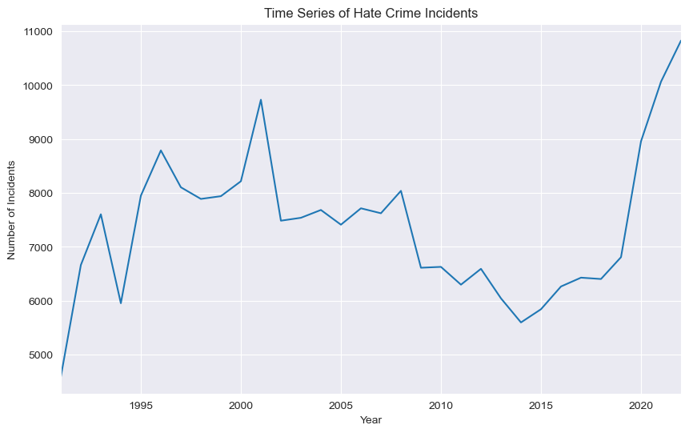

```python
import pandas as pd
import numpy as np

import matplotlib.pyplot as plt
import seaborn as sns
```


```python
# load the large dataset into a pandas dataframe hate_crime.csv
data = pd.read_csv('hate_crime.csv', encoding='latin1')
data
```


<div>
<style scoped>
    .dataframe tbody tr th:only-of-type {
        vertical-align: middle;
    }

    .dataframe tbody tr th {
        vertical-align: top;
    }

    .dataframe thead th {
        text-align: right;
    }
</style>
<table border="1" class="dataframe">
  <thead>
    <tr style="text-align: right;">
      <th></th>
      <th>incident_id</th>
      <th>data_year</th>
      <th>ori</th>
      <th>pug_agency_name</th>
      <th>pub_agency_unit</th>
      <th>agency_type_name</th>
      <th>state_abbr</th>
      <th>state_name</th>
      <th>division_name</th>
      <th>region_name</th>
      <th>...</th>
      <th>offender_race</th>
      <th>offender_ethnicity</th>
      <th>victim_count</th>
      <th>offense_name</th>
      <th>total_individual_victims</th>
      <th>location_name</th>
      <th>bias_desc</th>
      <th>victim_types</th>
      <th>multiple_offense</th>
      <th>multiple_bias</th>
    </tr>
  </thead>
  <tbody>
    <tr>
      <th>0</th>
      <td>43</td>
      <td>1991</td>
      <td>AR0350100</td>
      <td>Pine Bluff</td>
      <td>NaN</td>
      <td>City</td>
      <td>AR</td>
      <td>Arkansas</td>
      <td>West South Central</td>
      <td>South</td>
      <td>...</td>
      <td>Black or African American</td>
      <td>Not Specified</td>
      <td>1</td>
      <td>Aggravated Assault</td>
      <td>1.0</td>
      <td>Residence/Home</td>
      <td>Anti-Black or African American</td>
      <td>Individual</td>
      <td>S</td>
      <td>S</td>
    </tr>
    <tr>
      <th>1</th>
      <td>44</td>
      <td>1991</td>
      <td>AR0350100</td>
      <td>Pine Bluff</td>
      <td>NaN</td>
      <td>City</td>
      <td>AR</td>
      <td>Arkansas</td>
      <td>West South Central</td>
      <td>South</td>
      <td>...</td>
      <td>Black or African American</td>
      <td>Not Specified</td>
      <td>2</td>
      <td>Aggravated Assault;Destruction/Damage/Vandalis...</td>
      <td>1.0</td>
      <td>Highway/Road/Alley/Street/Sidewalk</td>
      <td>Anti-White</td>
      <td>Individual</td>
      <td>M</td>
      <td>S</td>
    </tr>
    <tr>
      <th>2</th>
      <td>45</td>
      <td>1991</td>
      <td>AR0600300</td>
      <td>North Little Rock</td>
      <td>NaN</td>
      <td>City</td>
      <td>AR</td>
      <td>Arkansas</td>
      <td>West South Central</td>
      <td>South</td>
      <td>...</td>
      <td>Black or African American</td>
      <td>Not Specified</td>
      <td>2</td>
      <td>Aggravated Assault;Murder and Nonnegligent Man...</td>
      <td>2.0</td>
      <td>Residence/Home</td>
      <td>Anti-White</td>
      <td>Individual</td>
      <td>M</td>
      <td>S</td>
    </tr>
    <tr>
      <th>3</th>
      <td>46</td>
      <td>1991</td>
      <td>AR0600300</td>
      <td>North Little Rock</td>
      <td>NaN</td>
      <td>City</td>
      <td>AR</td>
      <td>Arkansas</td>
      <td>West South Central</td>
      <td>South</td>
      <td>...</td>
      <td>Black or African American</td>
      <td>Not Specified</td>
      <td>1</td>
      <td>Intimidation</td>
      <td>1.0</td>
      <td>Residence/Home</td>
      <td>Anti-White</td>
      <td>Individual</td>
      <td>S</td>
      <td>S</td>
    </tr>
    <tr>
      <th>4</th>
      <td>47</td>
      <td>1991</td>
      <td>AR0670000</td>
      <td>Sevier</td>
      <td>NaN</td>
      <td>County</td>
      <td>AR</td>
      <td>Arkansas</td>
      <td>West South Central</td>
      <td>South</td>
      <td>...</td>
      <td>White</td>
      <td>Not Specified</td>
      <td>1</td>
      <td>Intimidation</td>
      <td>1.0</td>
      <td>School/College</td>
      <td>Anti-Black or African American</td>
      <td>Individual</td>
      <td>S</td>
      <td>S</td>
    </tr>
    <tr>
      <th>...</th>
      <td>...</td>
      <td>...</td>
      <td>...</td>
      <td>...</td>
      <td>...</td>
      <td>...</td>
      <td>...</td>
      <td>...</td>
      <td>...</td>
      <td>...</td>
      <td>...</td>
      <td>...</td>
      <td>...</td>
      <td>...</td>
      <td>...</td>
      <td>...</td>
      <td>...</td>
      <td>...</td>
      <td>...</td>
      <td>...</td>
      <td>...</td>
    </tr>
    <tr>
      <th>241658</th>
      <td>1473449</td>
      <td>2022</td>
      <td>WY0190200</td>
      <td>Rock Springs</td>
      <td>NaN</td>
      <td>City</td>
      <td>WY</td>
      <td>Wyoming</td>
      <td>Mountain</td>
      <td>West</td>
      <td>...</td>
      <td>White</td>
      <td>Hispanic or Latino</td>
      <td>2</td>
      <td>Simple Assault</td>
      <td>2.0</td>
      <td>Highway/Road/Alley/Street/Sidewalk</td>
      <td>Anti-White</td>
      <td>Individual</td>
      <td>S</td>
      <td>S</td>
    </tr>
    <tr>
      <th>241659</th>
      <td>1473450</td>
      <td>2022</td>
      <td>WY0010200</td>
      <td>University of Wyoming</td>
      <td>NaN</td>
      <td>University or College</td>
      <td>WY</td>
      <td>Wyoming</td>
      <td>Mountain</td>
      <td>West</td>
      <td>...</td>
      <td>White</td>
      <td>Not Hispanic or Latino</td>
      <td>1</td>
      <td>Intimidation</td>
      <td>1.0</td>
      <td>School-College/University</td>
      <td>Anti-Gay (Male)</td>
      <td>Individual</td>
      <td>S</td>
      <td>S</td>
    </tr>
    <tr>
      <th>241660</th>
      <td>1476554</td>
      <td>2022</td>
      <td>WY0190000</td>
      <td>Sweetwater</td>
      <td>NaN</td>
      <td>County</td>
      <td>WY</td>
      <td>Wyoming</td>
      <td>Mountain</td>
      <td>West</td>
      <td>...</td>
      <td>White</td>
      <td>Multiple</td>
      <td>2</td>
      <td>Simple Assault</td>
      <td>2.0</td>
      <td>Highway/Road/Alley/Street/Sidewalk</td>
      <td>Anti-Hispanic or Latino</td>
      <td>Individual</td>
      <td>S</td>
      <td>S</td>
    </tr>
    <tr>
      <th>241661</th>
      <td>1476555</td>
      <td>2022</td>
      <td>WY0110100</td>
      <td>Cheyenne</td>
      <td>NaN</td>
      <td>City</td>
      <td>WY</td>
      <td>Wyoming</td>
      <td>Mountain</td>
      <td>West</td>
      <td>...</td>
      <td>White</td>
      <td>Not Hispanic or Latino</td>
      <td>1</td>
      <td>Intimidation</td>
      <td>1.0</td>
      <td>Residence/Home</td>
      <td>Anti-Black or African American</td>
      <td>Individual</td>
      <td>S</td>
      <td>S</td>
    </tr>
    <tr>
      <th>241662</th>
      <td>1479088</td>
      <td>2022</td>
      <td>WY0190100</td>
      <td>Green River</td>
      <td>NaN</td>
      <td>City</td>
      <td>WY</td>
      <td>Wyoming</td>
      <td>Mountain</td>
      <td>West</td>
      <td>...</td>
      <td>White</td>
      <td>Not Hispanic or Latino</td>
      <td>1</td>
      <td>Simple Assault</td>
      <td>1.0</td>
      <td>School-Elementary/Secondary</td>
      <td>Anti-Lesbian, Gay, Bisexual, or Transgender (M...</td>
      <td>Individual</td>
      <td>S</td>
      <td>S</td>
    </tr>
  </tbody>
</table>
<p>241663 rows × 28 columns</p>
</div>


# Data Cleaning


```python
# get general information about the dataset
data.info()
```

    <class 'pandas.core.frame.DataFrame'>
    RangeIndex: 241663 entries, 0 to 241662
    Data columns (total 28 columns):
     #   Column                        Non-Null Count   Dtype  
    ---  ------                        --------------   -----  
     0   incident_id                   241663 non-null  int64  
     1   data_year                     241663 non-null  int64  
     2   ori                           241663 non-null  object 
     3   pug_agency_name               241663 non-null  object 
     4   pub_agency_unit               7189 non-null    object 
     5   agency_type_name              241663 non-null  object 
     6   state_abbr                    241663 non-null  object 
     7   state_name                    241663 non-null  object 
     8   division_name                 241663 non-null  object 
     9   region_name                   241663 non-null  object 
     10  population_group_code         241108 non-null  object 
     11  population_group_description  241108 non-null  object 
     12  incident_date                 241663 non-null  object 
     13  adult_victim_count            71125 non-null   float64
     14  juvenile_victim_count         68685 non-null   float64
     15  total_offender_count          241663 non-null  int64  
     16  adult_offender_count          64515 non-null   float64
     17  juvenile_offender_count       64508 non-null   float64
     18  offender_race                 241663 non-null  object 
     19  offender_ethnicity            241663 non-null  object 
     20  victim_count                  241663 non-null  int64  
     21  offense_name                  241663 non-null  object 
     22  total_individual_victims      236804 non-null  float64
     23  location_name                 241663 non-null  object 
     24  bias_desc                     241663 non-null  object 
     25  victim_types                  241663 non-null  object 
     26  multiple_offense              241663 non-null  object 
     27  multiple_bias                 241663 non-null  object 
    dtypes: float64(5), int64(4), object(19)
    memory usage: 51.6+ MB
    


```python
# find the amount of missing values in each column
data.isnull().sum()
```


    incident_id                          0
    data_year                            0
    ori                                  0
    pug_agency_name                      0
    pub_agency_unit                 234474
    agency_type_name                     0
    state_abbr                           0
    state_name                           0
    division_name                        0
    region_name                          0
    population_group_code              555
    population_group_description       555
    incident_date                        0
    adult_victim_count              170538
    juvenile_victim_count           172978
    total_offender_count                 0
    adult_offender_count            177148
    juvenile_offender_count         177155
    offender_race                        0
    offender_ethnicity                   0
    victim_count                         0
    offense_name                         0
    total_individual_victims          4859
    location_name                        0
    bias_desc                            0
    victim_types                         0
    multiple_offense                     0
    multiple_bias                        0
    dtype: int64


## The following columns will be dropped:
1. pub_agency_unit - because it has 234474 missing values
2. adult_victim_count - because it has 170538 missing values
3. juvenile_victim_count - because it has 172978 missing values
4. adult_offender_count - because it has 177148 missing values
5. juvenile_offender_count - because it has 177155 missing values


```python
# drop the columns with missing values
data = data.drop(['pub_agency_unit', 'adult_victim_count', 'juvenile_victim_count', 'adult_offender_count', 'juvenile_offender_count'], axis=1)
data
```


<div>
<style scoped>
    .dataframe tbody tr th:only-of-type {
        vertical-align: middle;
    }

    .dataframe tbody tr th {
        vertical-align: top;
    }

    .dataframe thead th {
        text-align: right;
    }
</style>
<table border="1" class="dataframe">
  <thead>
    <tr style="text-align: right;">
      <th></th>
      <th>incident_id</th>
      <th>data_year</th>
      <th>ori</th>
      <th>pug_agency_name</th>
      <th>agency_type_name</th>
      <th>state_abbr</th>
      <th>state_name</th>
      <th>division_name</th>
      <th>region_name</th>
      <th>population_group_code</th>
      <th>...</th>
      <th>offender_race</th>
      <th>offender_ethnicity</th>
      <th>victim_count</th>
      <th>offense_name</th>
      <th>total_individual_victims</th>
      <th>location_name</th>
      <th>bias_desc</th>
      <th>victim_types</th>
      <th>multiple_offense</th>
      <th>multiple_bias</th>
    </tr>
  </thead>
  <tbody>
    <tr>
      <th>0</th>
      <td>43</td>
      <td>1991</td>
      <td>AR0350100</td>
      <td>Pine Bluff</td>
      <td>City</td>
      <td>AR</td>
      <td>Arkansas</td>
      <td>West South Central</td>
      <td>South</td>
      <td>3</td>
      <td>...</td>
      <td>Black or African American</td>
      <td>Not Specified</td>
      <td>1</td>
      <td>Aggravated Assault</td>
      <td>1.0</td>
      <td>Residence/Home</td>
      <td>Anti-Black or African American</td>
      <td>Individual</td>
      <td>S</td>
      <td>S</td>
    </tr>
    <tr>
      <th>1</th>
      <td>44</td>
      <td>1991</td>
      <td>AR0350100</td>
      <td>Pine Bluff</td>
      <td>City</td>
      <td>AR</td>
      <td>Arkansas</td>
      <td>West South Central</td>
      <td>South</td>
      <td>3</td>
      <td>...</td>
      <td>Black or African American</td>
      <td>Not Specified</td>
      <td>2</td>
      <td>Aggravated Assault;Destruction/Damage/Vandalis...</td>
      <td>1.0</td>
      <td>Highway/Road/Alley/Street/Sidewalk</td>
      <td>Anti-White</td>
      <td>Individual</td>
      <td>M</td>
      <td>S</td>
    </tr>
    <tr>
      <th>2</th>
      <td>45</td>
      <td>1991</td>
      <td>AR0600300</td>
      <td>North Little Rock</td>
      <td>City</td>
      <td>AR</td>
      <td>Arkansas</td>
      <td>West South Central</td>
      <td>South</td>
      <td>3</td>
      <td>...</td>
      <td>Black or African American</td>
      <td>Not Specified</td>
      <td>2</td>
      <td>Aggravated Assault;Murder and Nonnegligent Man...</td>
      <td>2.0</td>
      <td>Residence/Home</td>
      <td>Anti-White</td>
      <td>Individual</td>
      <td>M</td>
      <td>S</td>
    </tr>
    <tr>
      <th>3</th>
      <td>46</td>
      <td>1991</td>
      <td>AR0600300</td>
      <td>North Little Rock</td>
      <td>City</td>
      <td>AR</td>
      <td>Arkansas</td>
      <td>West South Central</td>
      <td>South</td>
      <td>3</td>
      <td>...</td>
      <td>Black or African American</td>
      <td>Not Specified</td>
      <td>1</td>
      <td>Intimidation</td>
      <td>1.0</td>
      <td>Residence/Home</td>
      <td>Anti-White</td>
      <td>Individual</td>
      <td>S</td>
      <td>S</td>
    </tr>
    <tr>
      <th>4</th>
      <td>47</td>
      <td>1991</td>
      <td>AR0670000</td>
      <td>Sevier</td>
      <td>County</td>
      <td>AR</td>
      <td>Arkansas</td>
      <td>West South Central</td>
      <td>South</td>
      <td>8D</td>
      <td>...</td>
      <td>White</td>
      <td>Not Specified</td>
      <td>1</td>
      <td>Intimidation</td>
      <td>1.0</td>
      <td>School/College</td>
      <td>Anti-Black or African American</td>
      <td>Individual</td>
      <td>S</td>
      <td>S</td>
    </tr>
    <tr>
      <th>...</th>
      <td>...</td>
      <td>...</td>
      <td>...</td>
      <td>...</td>
      <td>...</td>
      <td>...</td>
      <td>...</td>
      <td>...</td>
      <td>...</td>
      <td>...</td>
      <td>...</td>
      <td>...</td>
      <td>...</td>
      <td>...</td>
      <td>...</td>
      <td>...</td>
      <td>...</td>
      <td>...</td>
      <td>...</td>
      <td>...</td>
      <td>...</td>
    </tr>
    <tr>
      <th>241658</th>
      <td>1473449</td>
      <td>2022</td>
      <td>WY0190200</td>
      <td>Rock Springs</td>
      <td>City</td>
      <td>WY</td>
      <td>Wyoming</td>
      <td>Mountain</td>
      <td>West</td>
      <td>5</td>
      <td>...</td>
      <td>White</td>
      <td>Hispanic or Latino</td>
      <td>2</td>
      <td>Simple Assault</td>
      <td>2.0</td>
      <td>Highway/Road/Alley/Street/Sidewalk</td>
      <td>Anti-White</td>
      <td>Individual</td>
      <td>S</td>
      <td>S</td>
    </tr>
    <tr>
      <th>241659</th>
      <td>1473450</td>
      <td>2022</td>
      <td>WY0010200</td>
      <td>University of Wyoming</td>
      <td>University or College</td>
      <td>WY</td>
      <td>Wyoming</td>
      <td>Mountain</td>
      <td>West</td>
      <td>7</td>
      <td>...</td>
      <td>White</td>
      <td>Not Hispanic or Latino</td>
      <td>1</td>
      <td>Intimidation</td>
      <td>1.0</td>
      <td>School-College/University</td>
      <td>Anti-Gay (Male)</td>
      <td>Individual</td>
      <td>S</td>
      <td>S</td>
    </tr>
    <tr>
      <th>241660</th>
      <td>1476554</td>
      <td>2022</td>
      <td>WY0190000</td>
      <td>Sweetwater</td>
      <td>County</td>
      <td>WY</td>
      <td>Wyoming</td>
      <td>Mountain</td>
      <td>West</td>
      <td>8D</td>
      <td>...</td>
      <td>White</td>
      <td>Multiple</td>
      <td>2</td>
      <td>Simple Assault</td>
      <td>2.0</td>
      <td>Highway/Road/Alley/Street/Sidewalk</td>
      <td>Anti-Hispanic or Latino</td>
      <td>Individual</td>
      <td>S</td>
      <td>S</td>
    </tr>
    <tr>
      <th>241661</th>
      <td>1476555</td>
      <td>2022</td>
      <td>WY0110100</td>
      <td>Cheyenne</td>
      <td>City</td>
      <td>WY</td>
      <td>Wyoming</td>
      <td>Mountain</td>
      <td>West</td>
      <td>3</td>
      <td>...</td>
      <td>White</td>
      <td>Not Hispanic or Latino</td>
      <td>1</td>
      <td>Intimidation</td>
      <td>1.0</td>
      <td>Residence/Home</td>
      <td>Anti-Black or African American</td>
      <td>Individual</td>
      <td>S</td>
      <td>S</td>
    </tr>
    <tr>
      <th>241662</th>
      <td>1479088</td>
      <td>2022</td>
      <td>WY0190100</td>
      <td>Green River</td>
      <td>City</td>
      <td>WY</td>
      <td>Wyoming</td>
      <td>Mountain</td>
      <td>West</td>
      <td>5</td>
      <td>...</td>
      <td>White</td>
      <td>Not Hispanic or Latino</td>
      <td>1</td>
      <td>Simple Assault</td>
      <td>1.0</td>
      <td>School-Elementary/Secondary</td>
      <td>Anti-Lesbian, Gay, Bisexual, or Transgender (M...</td>
      <td>Individual</td>
      <td>S</td>
      <td>S</td>
    </tr>
  </tbody>
</table>
<p>241663 rows × 23 columns</p>
</div>


## The following records with missing values will be dropped:
1. population_group_code - because it has 555 missing values
2. population_group_description - because it has 555 missing values
3. total_individual_victims - because it has 4859 missing values

The records with missing values will be dropped because they are few compared to the total number of records in the dataset.


```python
# drop the records with missing values
data = data.dropna()
data
```


<div>
<style scoped>
    .dataframe tbody tr th:only-of-type {
        vertical-align: middle;
    }

    .dataframe tbody tr th {
        vertical-align: top;
    }

    .dataframe thead th {
        text-align: right;
    }
</style>
<table border="1" class="dataframe">
  <thead>
    <tr style="text-align: right;">
      <th></th>
      <th>incident_id</th>
      <th>data_year</th>
      <th>ori</th>
      <th>pug_agency_name</th>
      <th>agency_type_name</th>
      <th>state_abbr</th>
      <th>state_name</th>
      <th>division_name</th>
      <th>region_name</th>
      <th>population_group_code</th>
      <th>...</th>
      <th>offender_race</th>
      <th>offender_ethnicity</th>
      <th>victim_count</th>
      <th>offense_name</th>
      <th>total_individual_victims</th>
      <th>location_name</th>
      <th>bias_desc</th>
      <th>victim_types</th>
      <th>multiple_offense</th>
      <th>multiple_bias</th>
    </tr>
  </thead>
  <tbody>
    <tr>
      <th>0</th>
      <td>43</td>
      <td>1991</td>
      <td>AR0350100</td>
      <td>Pine Bluff</td>
      <td>City</td>
      <td>AR</td>
      <td>Arkansas</td>
      <td>West South Central</td>
      <td>South</td>
      <td>3</td>
      <td>...</td>
      <td>Black or African American</td>
      <td>Not Specified</td>
      <td>1</td>
      <td>Aggravated Assault</td>
      <td>1.0</td>
      <td>Residence/Home</td>
      <td>Anti-Black or African American</td>
      <td>Individual</td>
      <td>S</td>
      <td>S</td>
    </tr>
    <tr>
      <th>1</th>
      <td>44</td>
      <td>1991</td>
      <td>AR0350100</td>
      <td>Pine Bluff</td>
      <td>City</td>
      <td>AR</td>
      <td>Arkansas</td>
      <td>West South Central</td>
      <td>South</td>
      <td>3</td>
      <td>...</td>
      <td>Black or African American</td>
      <td>Not Specified</td>
      <td>2</td>
      <td>Aggravated Assault;Destruction/Damage/Vandalis...</td>
      <td>1.0</td>
      <td>Highway/Road/Alley/Street/Sidewalk</td>
      <td>Anti-White</td>
      <td>Individual</td>
      <td>M</td>
      <td>S</td>
    </tr>
    <tr>
      <th>2</th>
      <td>45</td>
      <td>1991</td>
      <td>AR0600300</td>
      <td>North Little Rock</td>
      <td>City</td>
      <td>AR</td>
      <td>Arkansas</td>
      <td>West South Central</td>
      <td>South</td>
      <td>3</td>
      <td>...</td>
      <td>Black or African American</td>
      <td>Not Specified</td>
      <td>2</td>
      <td>Aggravated Assault;Murder and Nonnegligent Man...</td>
      <td>2.0</td>
      <td>Residence/Home</td>
      <td>Anti-White</td>
      <td>Individual</td>
      <td>M</td>
      <td>S</td>
    </tr>
    <tr>
      <th>3</th>
      <td>46</td>
      <td>1991</td>
      <td>AR0600300</td>
      <td>North Little Rock</td>
      <td>City</td>
      <td>AR</td>
      <td>Arkansas</td>
      <td>West South Central</td>
      <td>South</td>
      <td>3</td>
      <td>...</td>
      <td>Black or African American</td>
      <td>Not Specified</td>
      <td>1</td>
      <td>Intimidation</td>
      <td>1.0</td>
      <td>Residence/Home</td>
      <td>Anti-White</td>
      <td>Individual</td>
      <td>S</td>
      <td>S</td>
    </tr>
    <tr>
      <th>4</th>
      <td>47</td>
      <td>1991</td>
      <td>AR0670000</td>
      <td>Sevier</td>
      <td>County</td>
      <td>AR</td>
      <td>Arkansas</td>
      <td>West South Central</td>
      <td>South</td>
      <td>8D</td>
      <td>...</td>
      <td>White</td>
      <td>Not Specified</td>
      <td>1</td>
      <td>Intimidation</td>
      <td>1.0</td>
      <td>School/College</td>
      <td>Anti-Black or African American</td>
      <td>Individual</td>
      <td>S</td>
      <td>S</td>
    </tr>
    <tr>
      <th>...</th>
      <td>...</td>
      <td>...</td>
      <td>...</td>
      <td>...</td>
      <td>...</td>
      <td>...</td>
      <td>...</td>
      <td>...</td>
      <td>...</td>
      <td>...</td>
      <td>...</td>
      <td>...</td>
      <td>...</td>
      <td>...</td>
      <td>...</td>
      <td>...</td>
      <td>...</td>
      <td>...</td>
      <td>...</td>
      <td>...</td>
      <td>...</td>
    </tr>
    <tr>
      <th>241658</th>
      <td>1473449</td>
      <td>2022</td>
      <td>WY0190200</td>
      <td>Rock Springs</td>
      <td>City</td>
      <td>WY</td>
      <td>Wyoming</td>
      <td>Mountain</td>
      <td>West</td>
      <td>5</td>
      <td>...</td>
      <td>White</td>
      <td>Hispanic or Latino</td>
      <td>2</td>
      <td>Simple Assault</td>
      <td>2.0</td>
      <td>Highway/Road/Alley/Street/Sidewalk</td>
      <td>Anti-White</td>
      <td>Individual</td>
      <td>S</td>
      <td>S</td>
    </tr>
    <tr>
      <th>241659</th>
      <td>1473450</td>
      <td>2022</td>
      <td>WY0010200</td>
      <td>University of Wyoming</td>
      <td>University or College</td>
      <td>WY</td>
      <td>Wyoming</td>
      <td>Mountain</td>
      <td>West</td>
      <td>7</td>
      <td>...</td>
      <td>White</td>
      <td>Not Hispanic or Latino</td>
      <td>1</td>
      <td>Intimidation</td>
      <td>1.0</td>
      <td>School-College/University</td>
      <td>Anti-Gay (Male)</td>
      <td>Individual</td>
      <td>S</td>
      <td>S</td>
    </tr>
    <tr>
      <th>241660</th>
      <td>1476554</td>
      <td>2022</td>
      <td>WY0190000</td>
      <td>Sweetwater</td>
      <td>County</td>
      <td>WY</td>
      <td>Wyoming</td>
      <td>Mountain</td>
      <td>West</td>
      <td>8D</td>
      <td>...</td>
      <td>White</td>
      <td>Multiple</td>
      <td>2</td>
      <td>Simple Assault</td>
      <td>2.0</td>
      <td>Highway/Road/Alley/Street/Sidewalk</td>
      <td>Anti-Hispanic or Latino</td>
      <td>Individual</td>
      <td>S</td>
      <td>S</td>
    </tr>
    <tr>
      <th>241661</th>
      <td>1476555</td>
      <td>2022</td>
      <td>WY0110100</td>
      <td>Cheyenne</td>
      <td>City</td>
      <td>WY</td>
      <td>Wyoming</td>
      <td>Mountain</td>
      <td>West</td>
      <td>3</td>
      <td>...</td>
      <td>White</td>
      <td>Not Hispanic or Latino</td>
      <td>1</td>
      <td>Intimidation</td>
      <td>1.0</td>
      <td>Residence/Home</td>
      <td>Anti-Black or African American</td>
      <td>Individual</td>
      <td>S</td>
      <td>S</td>
    </tr>
    <tr>
      <th>241662</th>
      <td>1479088</td>
      <td>2022</td>
      <td>WY0190100</td>
      <td>Green River</td>
      <td>City</td>
      <td>WY</td>
      <td>Wyoming</td>
      <td>Mountain</td>
      <td>West</td>
      <td>5</td>
      <td>...</td>
      <td>White</td>
      <td>Not Hispanic or Latino</td>
      <td>1</td>
      <td>Simple Assault</td>
      <td>1.0</td>
      <td>School-Elementary/Secondary</td>
      <td>Anti-Lesbian, Gay, Bisexual, or Transgender (M...</td>
      <td>Individual</td>
      <td>S</td>
      <td>S</td>
    </tr>
  </tbody>
</table>
<p>236289 rows × 23 columns</p>
</div>


## Dropping Offender Ethnicity 

The offender ethnicity column can be dropped because it mostly contains missing values and won't be used in the analysis.


```python
# find the info for the offender_ethnicity column
data['offender_ethnicity'].value_counts()
```


    offender_ethnicity
    Not Specified             201698
    Unknown                    17396
    Not Hispanic or Latino     13174
    Hispanic or Latino          3192
    Multiple                     829
    Name: count, dtype: int64


```python
# drop the offender_ethnicity column
data = data.drop(['offender_ethnicity'], axis=1)
data
```


<div>
<style scoped>
    .dataframe tbody tr th:only-of-type {
        vertical-align: middle;
    }

    .dataframe tbody tr th {
        vertical-align: top;
    }

    .dataframe thead th {
        text-align: right;
    }
</style>
<table border="1" class="dataframe">
  <thead>
    <tr style="text-align: right;">
      <th></th>
      <th>incident_id</th>
      <th>data_year</th>
      <th>ori</th>
      <th>pug_agency_name</th>
      <th>agency_type_name</th>
      <th>state_abbr</th>
      <th>state_name</th>
      <th>division_name</th>
      <th>region_name</th>
      <th>population_group_code</th>
      <th>...</th>
      <th>total_offender_count</th>
      <th>offender_race</th>
      <th>victim_count</th>
      <th>offense_name</th>
      <th>total_individual_victims</th>
      <th>location_name</th>
      <th>bias_desc</th>
      <th>victim_types</th>
      <th>multiple_offense</th>
      <th>multiple_bias</th>
    </tr>
  </thead>
  <tbody>
    <tr>
      <th>0</th>
      <td>43</td>
      <td>1991</td>
      <td>AR0350100</td>
      <td>Pine Bluff</td>
      <td>City</td>
      <td>AR</td>
      <td>Arkansas</td>
      <td>West South Central</td>
      <td>South</td>
      <td>3</td>
      <td>...</td>
      <td>1</td>
      <td>Black or African American</td>
      <td>1</td>
      <td>Aggravated Assault</td>
      <td>1.0</td>
      <td>Residence/Home</td>
      <td>Anti-Black or African American</td>
      <td>Individual</td>
      <td>S</td>
      <td>S</td>
    </tr>
    <tr>
      <th>1</th>
      <td>44</td>
      <td>1991</td>
      <td>AR0350100</td>
      <td>Pine Bluff</td>
      <td>City</td>
      <td>AR</td>
      <td>Arkansas</td>
      <td>West South Central</td>
      <td>South</td>
      <td>3</td>
      <td>...</td>
      <td>1</td>
      <td>Black or African American</td>
      <td>2</td>
      <td>Aggravated Assault;Destruction/Damage/Vandalis...</td>
      <td>1.0</td>
      <td>Highway/Road/Alley/Street/Sidewalk</td>
      <td>Anti-White</td>
      <td>Individual</td>
      <td>M</td>
      <td>S</td>
    </tr>
    <tr>
      <th>2</th>
      <td>45</td>
      <td>1991</td>
      <td>AR0600300</td>
      <td>North Little Rock</td>
      <td>City</td>
      <td>AR</td>
      <td>Arkansas</td>
      <td>West South Central</td>
      <td>South</td>
      <td>3</td>
      <td>...</td>
      <td>1</td>
      <td>Black or African American</td>
      <td>2</td>
      <td>Aggravated Assault;Murder and Nonnegligent Man...</td>
      <td>2.0</td>
      <td>Residence/Home</td>
      <td>Anti-White</td>
      <td>Individual</td>
      <td>M</td>
      <td>S</td>
    </tr>
    <tr>
      <th>3</th>
      <td>46</td>
      <td>1991</td>
      <td>AR0600300</td>
      <td>North Little Rock</td>
      <td>City</td>
      <td>AR</td>
      <td>Arkansas</td>
      <td>West South Central</td>
      <td>South</td>
      <td>3</td>
      <td>...</td>
      <td>2</td>
      <td>Black or African American</td>
      <td>1</td>
      <td>Intimidation</td>
      <td>1.0</td>
      <td>Residence/Home</td>
      <td>Anti-White</td>
      <td>Individual</td>
      <td>S</td>
      <td>S</td>
    </tr>
    <tr>
      <th>4</th>
      <td>47</td>
      <td>1991</td>
      <td>AR0670000</td>
      <td>Sevier</td>
      <td>County</td>
      <td>AR</td>
      <td>Arkansas</td>
      <td>West South Central</td>
      <td>South</td>
      <td>8D</td>
      <td>...</td>
      <td>1</td>
      <td>White</td>
      <td>1</td>
      <td>Intimidation</td>
      <td>1.0</td>
      <td>School/College</td>
      <td>Anti-Black or African American</td>
      <td>Individual</td>
      <td>S</td>
      <td>S</td>
    </tr>
    <tr>
      <th>...</th>
      <td>...</td>
      <td>...</td>
      <td>...</td>
      <td>...</td>
      <td>...</td>
      <td>...</td>
      <td>...</td>
      <td>...</td>
      <td>...</td>
      <td>...</td>
      <td>...</td>
      <td>...</td>
      <td>...</td>
      <td>...</td>
      <td>...</td>
      <td>...</td>
      <td>...</td>
      <td>...</td>
      <td>...</td>
      <td>...</td>
      <td>...</td>
    </tr>
    <tr>
      <th>241658</th>
      <td>1473449</td>
      <td>2022</td>
      <td>WY0190200</td>
      <td>Rock Springs</td>
      <td>City</td>
      <td>WY</td>
      <td>Wyoming</td>
      <td>Mountain</td>
      <td>West</td>
      <td>5</td>
      <td>...</td>
      <td>1</td>
      <td>White</td>
      <td>2</td>
      <td>Simple Assault</td>
      <td>2.0</td>
      <td>Highway/Road/Alley/Street/Sidewalk</td>
      <td>Anti-White</td>
      <td>Individual</td>
      <td>S</td>
      <td>S</td>
    </tr>
    <tr>
      <th>241659</th>
      <td>1473450</td>
      <td>2022</td>
      <td>WY0010200</td>
      <td>University of Wyoming</td>
      <td>University or College</td>
      <td>WY</td>
      <td>Wyoming</td>
      <td>Mountain</td>
      <td>West</td>
      <td>7</td>
      <td>...</td>
      <td>1</td>
      <td>White</td>
      <td>1</td>
      <td>Intimidation</td>
      <td>1.0</td>
      <td>School-College/University</td>
      <td>Anti-Gay (Male)</td>
      <td>Individual</td>
      <td>S</td>
      <td>S</td>
    </tr>
    <tr>
      <th>241660</th>
      <td>1476554</td>
      <td>2022</td>
      <td>WY0190000</td>
      <td>Sweetwater</td>
      <td>County</td>
      <td>WY</td>
      <td>Wyoming</td>
      <td>Mountain</td>
      <td>West</td>
      <td>8D</td>
      <td>...</td>
      <td>2</td>
      <td>White</td>
      <td>2</td>
      <td>Simple Assault</td>
      <td>2.0</td>
      <td>Highway/Road/Alley/Street/Sidewalk</td>
      <td>Anti-Hispanic or Latino</td>
      <td>Individual</td>
      <td>S</td>
      <td>S</td>
    </tr>
    <tr>
      <th>241661</th>
      <td>1476555</td>
      <td>2022</td>
      <td>WY0110100</td>
      <td>Cheyenne</td>
      <td>City</td>
      <td>WY</td>
      <td>Wyoming</td>
      <td>Mountain</td>
      <td>West</td>
      <td>3</td>
      <td>...</td>
      <td>8</td>
      <td>White</td>
      <td>1</td>
      <td>Intimidation</td>
      <td>1.0</td>
      <td>Residence/Home</td>
      <td>Anti-Black or African American</td>
      <td>Individual</td>
      <td>S</td>
      <td>S</td>
    </tr>
    <tr>
      <th>241662</th>
      <td>1479088</td>
      <td>2022</td>
      <td>WY0190100</td>
      <td>Green River</td>
      <td>City</td>
      <td>WY</td>
      <td>Wyoming</td>
      <td>Mountain</td>
      <td>West</td>
      <td>5</td>
      <td>...</td>
      <td>1</td>
      <td>White</td>
      <td>1</td>
      <td>Simple Assault</td>
      <td>1.0</td>
      <td>School-Elementary/Secondary</td>
      <td>Anti-Lesbian, Gay, Bisexual, or Transgender (M...</td>
      <td>Individual</td>
      <td>S</td>
      <td>S</td>
    </tr>
  </tbody>
</table>
<p>236289 rows × 22 columns</p>
</div>


## Droppping More Columns

Furthermore, the Columns of:
- incident_id
- data_year
- ori
- pug_agency_name
- agency_type_name
- state_abbr
- division_name
- region_name* 
- population_group_code
- population_group_description


```python
data = data.drop(['incident_id', 'data_year', 'ori', 'pug_agency_name', 'agency_type_name', 'state_abbr', 'division_name', 'population_group_code', 'population_group_description'], axis=1)
data
```


<div>
<style scoped>
    .dataframe tbody tr th:only-of-type {
        vertical-align: middle;
    }

    .dataframe tbody tr th {
        vertical-align: top;
    }

    .dataframe thead th {
        text-align: right;
    }
</style>
<table border="1" class="dataframe">
  <thead>
    <tr style="text-align: right;">
      <th></th>
      <th>state_name</th>
      <th>region_name</th>
      <th>incident_date</th>
      <th>total_offender_count</th>
      <th>offender_race</th>
      <th>victim_count</th>
      <th>offense_name</th>
      <th>total_individual_victims</th>
      <th>location_name</th>
      <th>bias_desc</th>
      <th>victim_types</th>
      <th>multiple_offense</th>
      <th>multiple_bias</th>
    </tr>
  </thead>
  <tbody>
    <tr>
      <th>0</th>
      <td>Arkansas</td>
      <td>South</td>
      <td>1991-07-04</td>
      <td>1</td>
      <td>Black or African American</td>
      <td>1</td>
      <td>Aggravated Assault</td>
      <td>1.0</td>
      <td>Residence/Home</td>
      <td>Anti-Black or African American</td>
      <td>Individual</td>
      <td>S</td>
      <td>S</td>
    </tr>
    <tr>
      <th>1</th>
      <td>Arkansas</td>
      <td>South</td>
      <td>1991-12-24</td>
      <td>1</td>
      <td>Black or African American</td>
      <td>2</td>
      <td>Aggravated Assault;Destruction/Damage/Vandalis...</td>
      <td>1.0</td>
      <td>Highway/Road/Alley/Street/Sidewalk</td>
      <td>Anti-White</td>
      <td>Individual</td>
      <td>M</td>
      <td>S</td>
    </tr>
    <tr>
      <th>2</th>
      <td>Arkansas</td>
      <td>South</td>
      <td>1991-07-10</td>
      <td>1</td>
      <td>Black or African American</td>
      <td>2</td>
      <td>Aggravated Assault;Murder and Nonnegligent Man...</td>
      <td>2.0</td>
      <td>Residence/Home</td>
      <td>Anti-White</td>
      <td>Individual</td>
      <td>M</td>
      <td>S</td>
    </tr>
    <tr>
      <th>3</th>
      <td>Arkansas</td>
      <td>South</td>
      <td>1991-10-06</td>
      <td>2</td>
      <td>Black or African American</td>
      <td>1</td>
      <td>Intimidation</td>
      <td>1.0</td>
      <td>Residence/Home</td>
      <td>Anti-White</td>
      <td>Individual</td>
      <td>S</td>
      <td>S</td>
    </tr>
    <tr>
      <th>4</th>
      <td>Arkansas</td>
      <td>South</td>
      <td>1991-10-14</td>
      <td>1</td>
      <td>White</td>
      <td>1</td>
      <td>Intimidation</td>
      <td>1.0</td>
      <td>School/College</td>
      <td>Anti-Black or African American</td>
      <td>Individual</td>
      <td>S</td>
      <td>S</td>
    </tr>
    <tr>
      <th>...</th>
      <td>...</td>
      <td>...</td>
      <td>...</td>
      <td>...</td>
      <td>...</td>
      <td>...</td>
      <td>...</td>
      <td>...</td>
      <td>...</td>
      <td>...</td>
      <td>...</td>
      <td>...</td>
      <td>...</td>
    </tr>
    <tr>
      <th>241658</th>
      <td>Wyoming</td>
      <td>West</td>
      <td>2022-06-01</td>
      <td>1</td>
      <td>White</td>
      <td>2</td>
      <td>Simple Assault</td>
      <td>2.0</td>
      <td>Highway/Road/Alley/Street/Sidewalk</td>
      <td>Anti-White</td>
      <td>Individual</td>
      <td>S</td>
      <td>S</td>
    </tr>
    <tr>
      <th>241659</th>
      <td>Wyoming</td>
      <td>West</td>
      <td>2022-09-19</td>
      <td>1</td>
      <td>White</td>
      <td>1</td>
      <td>Intimidation</td>
      <td>1.0</td>
      <td>School-College/University</td>
      <td>Anti-Gay (Male)</td>
      <td>Individual</td>
      <td>S</td>
      <td>S</td>
    </tr>
    <tr>
      <th>241660</th>
      <td>Wyoming</td>
      <td>West</td>
      <td>2022-11-08</td>
      <td>2</td>
      <td>White</td>
      <td>2</td>
      <td>Simple Assault</td>
      <td>2.0</td>
      <td>Highway/Road/Alley/Street/Sidewalk</td>
      <td>Anti-Hispanic or Latino</td>
      <td>Individual</td>
      <td>S</td>
      <td>S</td>
    </tr>
    <tr>
      <th>241661</th>
      <td>Wyoming</td>
      <td>West</td>
      <td>2022-11-15</td>
      <td>8</td>
      <td>White</td>
      <td>1</td>
      <td>Intimidation</td>
      <td>1.0</td>
      <td>Residence/Home</td>
      <td>Anti-Black or African American</td>
      <td>Individual</td>
      <td>S</td>
      <td>S</td>
    </tr>
    <tr>
      <th>241662</th>
      <td>Wyoming</td>
      <td>West</td>
      <td>2022-12-01</td>
      <td>1</td>
      <td>White</td>
      <td>1</td>
      <td>Simple Assault</td>
      <td>1.0</td>
      <td>School-Elementary/Secondary</td>
      <td>Anti-Lesbian, Gay, Bisexual, or Transgender (M...</td>
      <td>Individual</td>
      <td>S</td>
      <td>S</td>
    </tr>
  </tbody>
</table>
<p>236289 rows × 13 columns</p>
</div>


```python
data.info()
```

    <class 'pandas.core.frame.DataFrame'>
    Index: 236289 entries, 0 to 241662
    Data columns (total 13 columns):
     #   Column                    Non-Null Count   Dtype  
    ---  ------                    --------------   -----  
     0   state_name                236289 non-null  object 
     1   region_name               236289 non-null  object 
     2   incident_date             236289 non-null  object 
     3   total_offender_count      236289 non-null  int64  
     4   offender_race             236289 non-null  object 
     5   victim_count              236289 non-null  int64  
     6   offense_name              236289 non-null  object 
     7   total_individual_victims  236289 non-null  float64
     8   location_name             236289 non-null  object 
     9   bias_desc                 236289 non-null  object 
     10  victim_types              236289 non-null  object 
     11  multiple_offense          236289 non-null  object 
     12  multiple_bias             236289 non-null  object 
    dtypes: float64(1), int64(2), object(10)
    memory usage: 25.2+ MB
    

## Bias_desc Cleaning

There are over 300 unique values in the bias_desc column. The column consists of one or more categories separated by a comma or semicolon. The column will converted into a list of categories.


```python
# output the info for the bias_desc column
data['bias_desc'].value_counts()
```


    bias_desc
    Anti-Black or African American                                               80210
    Anti-Jewish                                                                  27792
    Anti-White                                                                   27008
    Anti-Gay (Male)                                                              23659
    Anti-Hispanic or Latino                                                      15374
                                                                                 ...  
    Anti-Black or African American;Anti-Gay (Male);Anti-Islamic (Muslim)             1
    Anti-Hindu;Anti-Islamic (Muslim);Anti-Other Race/Ethnicity/Ancestry              1
    Anti-Gay (Male);Anti-Hispanic or Latino;Anti-Male                                1
    Anti-Jewish;Anti-Mental Disability;Anti-White                                    1
    Anti-American Indian or Alaska Native;Anti-Female;Anti-Hispanic or Latino        1
    Name: count, Length: 345, dtype: int64


```python
# remove the special characters from the bias_desc column
data['bias_desc'] = data['bias_desc'].str.replace('(', '')
data['bias_desc'] = data['bias_desc'].str.replace(')', '')

# convert the bias_desc column into a list of categories
data['bias_desc'] = data['bias_desc'].str.replace(';', ',').str.split(',')
data
```


<div>
<style scoped>
    .dataframe tbody tr th:only-of-type {
        vertical-align: middle;
    }

    .dataframe tbody tr th {
        vertical-align: top;
    }

    .dataframe thead th {
        text-align: right;
    }
</style>
<table border="1" class="dataframe">
  <thead>
    <tr style="text-align: right;">
      <th></th>
      <th>state_name</th>
      <th>region_name</th>
      <th>incident_date</th>
      <th>total_offender_count</th>
      <th>offender_race</th>
      <th>victim_count</th>
      <th>offense_name</th>
      <th>total_individual_victims</th>
      <th>location_name</th>
      <th>bias_desc</th>
      <th>victim_types</th>
      <th>multiple_offense</th>
      <th>multiple_bias</th>
    </tr>
  </thead>
  <tbody>
    <tr>
      <th>0</th>
      <td>Arkansas</td>
      <td>South</td>
      <td>1991-07-04</td>
      <td>1</td>
      <td>Black or African American</td>
      <td>1</td>
      <td>Aggravated Assault</td>
      <td>1.0</td>
      <td>Residence/Home</td>
      <td>[Anti-Black or African American]</td>
      <td>Individual</td>
      <td>S</td>
      <td>S</td>
    </tr>
    <tr>
      <th>1</th>
      <td>Arkansas</td>
      <td>South</td>
      <td>1991-12-24</td>
      <td>1</td>
      <td>Black or African American</td>
      <td>2</td>
      <td>Aggravated Assault;Destruction/Damage/Vandalis...</td>
      <td>1.0</td>
      <td>Highway/Road/Alley/Street/Sidewalk</td>
      <td>[Anti-White]</td>
      <td>Individual</td>
      <td>M</td>
      <td>S</td>
    </tr>
    <tr>
      <th>2</th>
      <td>Arkansas</td>
      <td>South</td>
      <td>1991-07-10</td>
      <td>1</td>
      <td>Black or African American</td>
      <td>2</td>
      <td>Aggravated Assault;Murder and Nonnegligent Man...</td>
      <td>2.0</td>
      <td>Residence/Home</td>
      <td>[Anti-White]</td>
      <td>Individual</td>
      <td>M</td>
      <td>S</td>
    </tr>
    <tr>
      <th>3</th>
      <td>Arkansas</td>
      <td>South</td>
      <td>1991-10-06</td>
      <td>2</td>
      <td>Black or African American</td>
      <td>1</td>
      <td>Intimidation</td>
      <td>1.0</td>
      <td>Residence/Home</td>
      <td>[Anti-White]</td>
      <td>Individual</td>
      <td>S</td>
      <td>S</td>
    </tr>
    <tr>
      <th>4</th>
      <td>Arkansas</td>
      <td>South</td>
      <td>1991-10-14</td>
      <td>1</td>
      <td>White</td>
      <td>1</td>
      <td>Intimidation</td>
      <td>1.0</td>
      <td>School/College</td>
      <td>[Anti-Black or African American]</td>
      <td>Individual</td>
      <td>S</td>
      <td>S</td>
    </tr>
    <tr>
      <th>...</th>
      <td>...</td>
      <td>...</td>
      <td>...</td>
      <td>...</td>
      <td>...</td>
      <td>...</td>
      <td>...</td>
      <td>...</td>
      <td>...</td>
      <td>...</td>
      <td>...</td>
      <td>...</td>
      <td>...</td>
    </tr>
    <tr>
      <th>241658</th>
      <td>Wyoming</td>
      <td>West</td>
      <td>2022-06-01</td>
      <td>1</td>
      <td>White</td>
      <td>2</td>
      <td>Simple Assault</td>
      <td>2.0</td>
      <td>Highway/Road/Alley/Street/Sidewalk</td>
      <td>[Anti-White]</td>
      <td>Individual</td>
      <td>S</td>
      <td>S</td>
    </tr>
    <tr>
      <th>241659</th>
      <td>Wyoming</td>
      <td>West</td>
      <td>2022-09-19</td>
      <td>1</td>
      <td>White</td>
      <td>1</td>
      <td>Intimidation</td>
      <td>1.0</td>
      <td>School-College/University</td>
      <td>[Anti-Gay Male]</td>
      <td>Individual</td>
      <td>S</td>
      <td>S</td>
    </tr>
    <tr>
      <th>241660</th>
      <td>Wyoming</td>
      <td>West</td>
      <td>2022-11-08</td>
      <td>2</td>
      <td>White</td>
      <td>2</td>
      <td>Simple Assault</td>
      <td>2.0</td>
      <td>Highway/Road/Alley/Street/Sidewalk</td>
      <td>[Anti-Hispanic or Latino]</td>
      <td>Individual</td>
      <td>S</td>
      <td>S</td>
    </tr>
    <tr>
      <th>241661</th>
      <td>Wyoming</td>
      <td>West</td>
      <td>2022-11-15</td>
      <td>8</td>
      <td>White</td>
      <td>1</td>
      <td>Intimidation</td>
      <td>1.0</td>
      <td>Residence/Home</td>
      <td>[Anti-Black or African American]</td>
      <td>Individual</td>
      <td>S</td>
      <td>S</td>
    </tr>
    <tr>
      <th>241662</th>
      <td>Wyoming</td>
      <td>West</td>
      <td>2022-12-01</td>
      <td>1</td>
      <td>White</td>
      <td>1</td>
      <td>Simple Assault</td>
      <td>1.0</td>
      <td>School-Elementary/Secondary</td>
      <td>[Anti-Lesbian,  Gay,  Bisexual,  or Transgende...</td>
      <td>Individual</td>
      <td>S</td>
      <td>S</td>
    </tr>
  </tbody>
</table>
<p>236289 rows × 13 columns</p>
</div>


```python
# one hot encode the bias_desc column
def one_hot_encode(column):
    #transforms elements in lists to rows
    types = column.explode() 
    
    # returns the frequency of each type for each index
    oneHotEncode = pd.crosstab(types.index, types)
    
    return oneHotEncode
```


```python
one_hot_bias_desc = one_hot_encode(data['bias_desc'])
one_hot_bias_desc
```


<div>
<style scoped>
    .dataframe tbody tr th:only-of-type {
        vertical-align: middle;
    }

    .dataframe tbody tr th {
        vertical-align: top;
    }

    .dataframe thead th {
        text-align: right;
    }
</style>
<table border="1" class="dataframe">
  <thead>
    <tr style="text-align: right;">
      <th>bias_desc</th>
      <th>Bisexual</th>
      <th>Gay</th>
      <th>Greek</th>
      <th>Group</th>
      <th>Other</th>
      <th>or Transgender Mixed Group</th>
      <th>Anti-American Indian or Alaska Native</th>
      <th>Anti-Arab</th>
      <th>Anti-Asian</th>
      <th>Anti-Atheism/Agnosticism</th>
      <th>...</th>
      <th>Anti-Multiple Religions</th>
      <th>Anti-Native Hawaiian or Other Pacific Islander</th>
      <th>Anti-Other Christian</th>
      <th>Anti-Other Race/Ethnicity/Ancestry</th>
      <th>Anti-Other Religion</th>
      <th>Anti-Physical Disability</th>
      <th>Anti-Protestant</th>
      <th>Anti-Sikh</th>
      <th>Anti-Transgender</th>
      <th>Anti-White</th>
    </tr>
    <tr>
      <th>row_0</th>
      <th></th>
      <th></th>
      <th></th>
      <th></th>
      <th></th>
      <th></th>
      <th></th>
      <th></th>
      <th></th>
      <th></th>
      <th></th>
      <th></th>
      <th></th>
      <th></th>
      <th></th>
      <th></th>
      <th></th>
      <th></th>
      <th></th>
      <th></th>
      <th></th>
    </tr>
  </thead>
  <tbody>
    <tr>
      <th>0</th>
      <td>0</td>
      <td>0</td>
      <td>0</td>
      <td>0</td>
      <td>0</td>
      <td>0</td>
      <td>0</td>
      <td>0</td>
      <td>0</td>
      <td>0</td>
      <td>...</td>
      <td>0</td>
      <td>0</td>
      <td>0</td>
      <td>0</td>
      <td>0</td>
      <td>0</td>
      <td>0</td>
      <td>0</td>
      <td>0</td>
      <td>0</td>
    </tr>
    <tr>
      <th>1</th>
      <td>0</td>
      <td>0</td>
      <td>0</td>
      <td>0</td>
      <td>0</td>
      <td>0</td>
      <td>0</td>
      <td>0</td>
      <td>0</td>
      <td>0</td>
      <td>...</td>
      <td>0</td>
      <td>0</td>
      <td>0</td>
      <td>0</td>
      <td>0</td>
      <td>0</td>
      <td>0</td>
      <td>0</td>
      <td>0</td>
      <td>1</td>
    </tr>
    <tr>
      <th>2</th>
      <td>0</td>
      <td>0</td>
      <td>0</td>
      <td>0</td>
      <td>0</td>
      <td>0</td>
      <td>0</td>
      <td>0</td>
      <td>0</td>
      <td>0</td>
      <td>...</td>
      <td>0</td>
      <td>0</td>
      <td>0</td>
      <td>0</td>
      <td>0</td>
      <td>0</td>
      <td>0</td>
      <td>0</td>
      <td>0</td>
      <td>1</td>
    </tr>
    <tr>
      <th>3</th>
      <td>0</td>
      <td>0</td>
      <td>0</td>
      <td>0</td>
      <td>0</td>
      <td>0</td>
      <td>0</td>
      <td>0</td>
      <td>0</td>
      <td>0</td>
      <td>...</td>
      <td>0</td>
      <td>0</td>
      <td>0</td>
      <td>0</td>
      <td>0</td>
      <td>0</td>
      <td>0</td>
      <td>0</td>
      <td>0</td>
      <td>1</td>
    </tr>
    <tr>
      <th>4</th>
      <td>0</td>
      <td>0</td>
      <td>0</td>
      <td>0</td>
      <td>0</td>
      <td>0</td>
      <td>0</td>
      <td>0</td>
      <td>0</td>
      <td>0</td>
      <td>...</td>
      <td>0</td>
      <td>0</td>
      <td>0</td>
      <td>0</td>
      <td>0</td>
      <td>0</td>
      <td>0</td>
      <td>0</td>
      <td>0</td>
      <td>0</td>
    </tr>
    <tr>
      <th>...</th>
      <td>...</td>
      <td>...</td>
      <td>...</td>
      <td>...</td>
      <td>...</td>
      <td>...</td>
      <td>...</td>
      <td>...</td>
      <td>...</td>
      <td>...</td>
      <td>...</td>
      <td>...</td>
      <td>...</td>
      <td>...</td>
      <td>...</td>
      <td>...</td>
      <td>...</td>
      <td>...</td>
      <td>...</td>
      <td>...</td>
      <td>...</td>
    </tr>
    <tr>
      <th>241658</th>
      <td>0</td>
      <td>0</td>
      <td>0</td>
      <td>0</td>
      <td>0</td>
      <td>0</td>
      <td>0</td>
      <td>0</td>
      <td>0</td>
      <td>0</td>
      <td>...</td>
      <td>0</td>
      <td>0</td>
      <td>0</td>
      <td>0</td>
      <td>0</td>
      <td>0</td>
      <td>0</td>
      <td>0</td>
      <td>0</td>
      <td>1</td>
    </tr>
    <tr>
      <th>241659</th>
      <td>0</td>
      <td>0</td>
      <td>0</td>
      <td>0</td>
      <td>0</td>
      <td>0</td>
      <td>0</td>
      <td>0</td>
      <td>0</td>
      <td>0</td>
      <td>...</td>
      <td>0</td>
      <td>0</td>
      <td>0</td>
      <td>0</td>
      <td>0</td>
      <td>0</td>
      <td>0</td>
      <td>0</td>
      <td>0</td>
      <td>0</td>
    </tr>
    <tr>
      <th>241660</th>
      <td>0</td>
      <td>0</td>
      <td>0</td>
      <td>0</td>
      <td>0</td>
      <td>0</td>
      <td>0</td>
      <td>0</td>
      <td>0</td>
      <td>0</td>
      <td>...</td>
      <td>0</td>
      <td>0</td>
      <td>0</td>
      <td>0</td>
      <td>0</td>
      <td>0</td>
      <td>0</td>
      <td>0</td>
      <td>0</td>
      <td>0</td>
    </tr>
    <tr>
      <th>241661</th>
      <td>0</td>
      <td>0</td>
      <td>0</td>
      <td>0</td>
      <td>0</td>
      <td>0</td>
      <td>0</td>
      <td>0</td>
      <td>0</td>
      <td>0</td>
      <td>...</td>
      <td>0</td>
      <td>0</td>
      <td>0</td>
      <td>0</td>
      <td>0</td>
      <td>0</td>
      <td>0</td>
      <td>0</td>
      <td>0</td>
      <td>0</td>
    </tr>
    <tr>
      <th>241662</th>
      <td>1</td>
      <td>1</td>
      <td>0</td>
      <td>0</td>
      <td>0</td>
      <td>1</td>
      <td>0</td>
      <td>0</td>
      <td>0</td>
      <td>0</td>
      <td>...</td>
      <td>0</td>
      <td>0</td>
      <td>0</td>
      <td>0</td>
      <td>0</td>
      <td>0</td>
      <td>0</td>
      <td>0</td>
      <td>0</td>
      <td>0</td>
    </tr>
  </tbody>
</table>
<p>236289 rows × 40 columns</p>
</div>


From the one hot encoded dataframe of the bias_desc column we can see that there are 40 unique categories. The categories will be merged with the original dataset.


```python
data = data.drop("bias_desc", axis=1)
```


```python
# merge the one hot encoded bias_desc column with the original dataset
data = pd.concat([data, one_hot_bias_desc], axis=1)
data
```


<div>
<style scoped>
    .dataframe tbody tr th:only-of-type {
        vertical-align: middle;
    }

    .dataframe tbody tr th {
        vertical-align: top;
    }

    .dataframe thead th {
        text-align: right;
    }
</style>
<table border="1" class="dataframe">
  <thead>
    <tr style="text-align: right;">
      <th></th>
      <th>state_name</th>
      <th>region_name</th>
      <th>incident_date</th>
      <th>total_offender_count</th>
      <th>offender_race</th>
      <th>victim_count</th>
      <th>offense_name</th>
      <th>total_individual_victims</th>
      <th>location_name</th>
      <th>victim_types</th>
      <th>...</th>
      <th>Anti-Multiple Religions</th>
      <th>Anti-Native Hawaiian or Other Pacific Islander</th>
      <th>Anti-Other Christian</th>
      <th>Anti-Other Race/Ethnicity/Ancestry</th>
      <th>Anti-Other Religion</th>
      <th>Anti-Physical Disability</th>
      <th>Anti-Protestant</th>
      <th>Anti-Sikh</th>
      <th>Anti-Transgender</th>
      <th>Anti-White</th>
    </tr>
  </thead>
  <tbody>
    <tr>
      <th>0</th>
      <td>Arkansas</td>
      <td>South</td>
      <td>1991-07-04</td>
      <td>1</td>
      <td>Black or African American</td>
      <td>1</td>
      <td>Aggravated Assault</td>
      <td>1.0</td>
      <td>Residence/Home</td>
      <td>Individual</td>
      <td>...</td>
      <td>0</td>
      <td>0</td>
      <td>0</td>
      <td>0</td>
      <td>0</td>
      <td>0</td>
      <td>0</td>
      <td>0</td>
      <td>0</td>
      <td>0</td>
    </tr>
    <tr>
      <th>1</th>
      <td>Arkansas</td>
      <td>South</td>
      <td>1991-12-24</td>
      <td>1</td>
      <td>Black or African American</td>
      <td>2</td>
      <td>Aggravated Assault;Destruction/Damage/Vandalis...</td>
      <td>1.0</td>
      <td>Highway/Road/Alley/Street/Sidewalk</td>
      <td>Individual</td>
      <td>...</td>
      <td>0</td>
      <td>0</td>
      <td>0</td>
      <td>0</td>
      <td>0</td>
      <td>0</td>
      <td>0</td>
      <td>0</td>
      <td>0</td>
      <td>1</td>
    </tr>
    <tr>
      <th>2</th>
      <td>Arkansas</td>
      <td>South</td>
      <td>1991-07-10</td>
      <td>1</td>
      <td>Black or African American</td>
      <td>2</td>
      <td>Aggravated Assault;Murder and Nonnegligent Man...</td>
      <td>2.0</td>
      <td>Residence/Home</td>
      <td>Individual</td>
      <td>...</td>
      <td>0</td>
      <td>0</td>
      <td>0</td>
      <td>0</td>
      <td>0</td>
      <td>0</td>
      <td>0</td>
      <td>0</td>
      <td>0</td>
      <td>1</td>
    </tr>
    <tr>
      <th>3</th>
      <td>Arkansas</td>
      <td>South</td>
      <td>1991-10-06</td>
      <td>2</td>
      <td>Black or African American</td>
      <td>1</td>
      <td>Intimidation</td>
      <td>1.0</td>
      <td>Residence/Home</td>
      <td>Individual</td>
      <td>...</td>
      <td>0</td>
      <td>0</td>
      <td>0</td>
      <td>0</td>
      <td>0</td>
      <td>0</td>
      <td>0</td>
      <td>0</td>
      <td>0</td>
      <td>1</td>
    </tr>
    <tr>
      <th>4</th>
      <td>Arkansas</td>
      <td>South</td>
      <td>1991-10-14</td>
      <td>1</td>
      <td>White</td>
      <td>1</td>
      <td>Intimidation</td>
      <td>1.0</td>
      <td>School/College</td>
      <td>Individual</td>
      <td>...</td>
      <td>0</td>
      <td>0</td>
      <td>0</td>
      <td>0</td>
      <td>0</td>
      <td>0</td>
      <td>0</td>
      <td>0</td>
      <td>0</td>
      <td>0</td>
    </tr>
    <tr>
      <th>...</th>
      <td>...</td>
      <td>...</td>
      <td>...</td>
      <td>...</td>
      <td>...</td>
      <td>...</td>
      <td>...</td>
      <td>...</td>
      <td>...</td>
      <td>...</td>
      <td>...</td>
      <td>...</td>
      <td>...</td>
      <td>...</td>
      <td>...</td>
      <td>...</td>
      <td>...</td>
      <td>...</td>
      <td>...</td>
      <td>...</td>
      <td>...</td>
    </tr>
    <tr>
      <th>241658</th>
      <td>Wyoming</td>
      <td>West</td>
      <td>2022-06-01</td>
      <td>1</td>
      <td>White</td>
      <td>2</td>
      <td>Simple Assault</td>
      <td>2.0</td>
      <td>Highway/Road/Alley/Street/Sidewalk</td>
      <td>Individual</td>
      <td>...</td>
      <td>0</td>
      <td>0</td>
      <td>0</td>
      <td>0</td>
      <td>0</td>
      <td>0</td>
      <td>0</td>
      <td>0</td>
      <td>0</td>
      <td>1</td>
    </tr>
    <tr>
      <th>241659</th>
      <td>Wyoming</td>
      <td>West</td>
      <td>2022-09-19</td>
      <td>1</td>
      <td>White</td>
      <td>1</td>
      <td>Intimidation</td>
      <td>1.0</td>
      <td>School-College/University</td>
      <td>Individual</td>
      <td>...</td>
      <td>0</td>
      <td>0</td>
      <td>0</td>
      <td>0</td>
      <td>0</td>
      <td>0</td>
      <td>0</td>
      <td>0</td>
      <td>0</td>
      <td>0</td>
    </tr>
    <tr>
      <th>241660</th>
      <td>Wyoming</td>
      <td>West</td>
      <td>2022-11-08</td>
      <td>2</td>
      <td>White</td>
      <td>2</td>
      <td>Simple Assault</td>
      <td>2.0</td>
      <td>Highway/Road/Alley/Street/Sidewalk</td>
      <td>Individual</td>
      <td>...</td>
      <td>0</td>
      <td>0</td>
      <td>0</td>
      <td>0</td>
      <td>0</td>
      <td>0</td>
      <td>0</td>
      <td>0</td>
      <td>0</td>
      <td>0</td>
    </tr>
    <tr>
      <th>241661</th>
      <td>Wyoming</td>
      <td>West</td>
      <td>2022-11-15</td>
      <td>8</td>
      <td>White</td>
      <td>1</td>
      <td>Intimidation</td>
      <td>1.0</td>
      <td>Residence/Home</td>
      <td>Individual</td>
      <td>...</td>
      <td>0</td>
      <td>0</td>
      <td>0</td>
      <td>0</td>
      <td>0</td>
      <td>0</td>
      <td>0</td>
      <td>0</td>
      <td>0</td>
      <td>0</td>
    </tr>
    <tr>
      <th>241662</th>
      <td>Wyoming</td>
      <td>West</td>
      <td>2022-12-01</td>
      <td>1</td>
      <td>White</td>
      <td>1</td>
      <td>Simple Assault</td>
      <td>1.0</td>
      <td>School-Elementary/Secondary</td>
      <td>Individual</td>
      <td>...</td>
      <td>0</td>
      <td>0</td>
      <td>0</td>
      <td>0</td>
      <td>0</td>
      <td>0</td>
      <td>0</td>
      <td>0</td>
      <td>0</td>
      <td>0</td>
    </tr>
  </tbody>
</table>
<p>236289 rows × 52 columns</p>
</div>


```python
print(data.info())
```

    <class 'pandas.core.frame.DataFrame'>
    Index: 236289 entries, 0 to 241662
    Data columns (total 52 columns):
     #   Column                                          Non-Null Count   Dtype  
    ---  ------                                          --------------   -----  
     0   state_name                                      236289 non-null  object 
     1   region_name                                     236289 non-null  object 
     2   incident_date                                   236289 non-null  object 
     3   total_offender_count                            236289 non-null  int64  
     4   offender_race                                   236289 non-null  object 
     5   victim_count                                    236289 non-null  int64  
     6   offense_name                                    236289 non-null  object 
     7   total_individual_victims                        236289 non-null  float64
     8   location_name                                   236289 non-null  object 
     9   victim_types                                    236289 non-null  object 
     10  multiple_offense                                236289 non-null  object 
     11  multiple_bias                                   236289 non-null  object 
     12   Bisexual                                       236289 non-null  int64  
     13   Gay                                            236289 non-null  int64  
     14   Greek                                          236289 non-null  int64  
     15   Group                                          236289 non-null  int64  
     16   Other                                          236289 non-null  int64  
     17   or Transgender Mixed Group                     236289 non-null  int64  
     18  Anti-American Indian or Alaska Native           236289 non-null  int64  
     19  Anti-Arab                                       236289 non-null  int64  
     20  Anti-Asian                                      236289 non-null  int64  
     21  Anti-Atheism/Agnosticism                        236289 non-null  int64  
     22  Anti-Bisexual                                   236289 non-null  int64  
     23  Anti-Black or African American                  236289 non-null  int64  
     24  Anti-Buddhist                                   236289 non-null  int64  
     25  Anti-Catholic                                   236289 non-null  int64  
     26  Anti-Church of Jesus Christ                     236289 non-null  int64  
     27  Anti-Eastern Orthodox Russian                   236289 non-null  int64  
     28  Anti-Female                                     236289 non-null  int64  
     29  Anti-Gay Male                                   236289 non-null  int64  
     30  Anti-Gender Non-Conforming                      236289 non-null  int64  
     31  Anti-Heterosexual                               236289 non-null  int64  
     32  Anti-Hindu                                      236289 non-null  int64  
     33  Anti-Hispanic or Latino                         236289 non-null  int64  
     34  Anti-Islamic Muslim                             236289 non-null  int64  
     35  Anti-Jehovah's Witness                          236289 non-null  int64  
     36  Anti-Jewish                                     236289 non-null  int64  
     37  Anti-Lesbian                                    236289 non-null  int64  
     38  Anti-Lesbian Female                             236289 non-null  int64  
     39  Anti-Male                                       236289 non-null  int64  
     40  Anti-Mental Disability                          236289 non-null  int64  
     41  Anti-Multiple Races                             236289 non-null  int64  
     42  Anti-Multiple Religions                         236289 non-null  int64  
     43  Anti-Native Hawaiian or Other Pacific Islander  236289 non-null  int64  
     44  Anti-Other Christian                            236289 non-null  int64  
     45  Anti-Other Race/Ethnicity/Ancestry              236289 non-null  int64  
     46  Anti-Other Religion                             236289 non-null  int64  
     47  Anti-Physical Disability                        236289 non-null  int64  
     48  Anti-Protestant                                 236289 non-null  int64  
     49  Anti-Sikh                                       236289 non-null  int64  
     50  Anti-Transgender                                236289 non-null  int64  
     51  Anti-White                                      236289 non-null  int64  
    dtypes: float64(1), int64(42), object(9)
    memory usage: 95.5+ MB
    None
    

### Summary Statistics


```python
#storing data types that are object to a variable to perform a describe
text = data.dtypes[data.dtypes == "object"].index
text
```


    Index(['state_name', 'region_name', 'incident_date', 'offender_race',
           'offense_name', 'location_name', 'victim_types', 'multiple_offense',
           'multiple_bias'],
          dtype='object')


```python
data[text].describe()
```


<div>
<style scoped>
    .dataframe tbody tr th:only-of-type {
        vertical-align: middle;
    }

    .dataframe tbody tr th {
        vertical-align: top;
    }

    .dataframe thead th {
        text-align: right;
    }
</style>
<table border="1" class="dataframe">
  <thead>
    <tr style="text-align: right;">
      <th></th>
      <th>state_name</th>
      <th>region_name</th>
      <th>incident_date</th>
      <th>offender_race</th>
      <th>offense_name</th>
      <th>location_name</th>
      <th>victim_types</th>
      <th>multiple_offense</th>
      <th>multiple_bias</th>
    </tr>
  </thead>
  <tbody>
    <tr>
      <th>count</th>
      <td>236289</td>
      <td>236289</td>
      <td>236289</td>
      <td>236289</td>
      <td>236289</td>
      <td>236289</td>
      <td>236289</td>
      <td>236289</td>
      <td>236289</td>
    </tr>
    <tr>
      <th>unique</th>
      <td>53</td>
      <td>6</td>
      <td>11688</td>
      <td>8</td>
      <td>393</td>
      <td>149</td>
      <td>55</td>
      <td>2</td>
      <td>2</td>
    </tr>
    <tr>
      <th>top</th>
      <td>California</td>
      <td>West</td>
      <td>2001-09-12</td>
      <td>White</td>
      <td>Intimidation</td>
      <td>Residence/Home</td>
      <td>Individual</td>
      <td>S</td>
      <td>S</td>
    </tr>
    <tr>
      <th>freq</th>
      <td>39024</td>
      <td>73083</td>
      <td>178</td>
      <td>94377</td>
      <td>70178</td>
      <td>70570</td>
      <td>190923</td>
      <td>228120</td>
      <td>234869</td>
    </tr>
  </tbody>
</table>
</div>


```python
data.describe()
```


<div>
<style scoped>
    .dataframe tbody tr th:only-of-type {
        vertical-align: middle;
    }

    .dataframe tbody tr th {
        vertical-align: top;
    }

    .dataframe thead th {
        text-align: right;
    }
</style>
<table border="1" class="dataframe">
  <thead>
    <tr style="text-align: right;">
      <th></th>
      <th>total_offender_count</th>
      <th>victim_count</th>
      <th>total_individual_victims</th>
      <th>Bisexual</th>
      <th>Gay</th>
      <th>Greek</th>
      <th>Group</th>
      <th>Other</th>
      <th>or Transgender Mixed Group</th>
      <th>Anti-American Indian or Alaska Native</th>
      <th>...</th>
      <th>Anti-Multiple Religions</th>
      <th>Anti-Native Hawaiian or Other Pacific Islander</th>
      <th>Anti-Other Christian</th>
      <th>Anti-Other Race/Ethnicity/Ancestry</th>
      <th>Anti-Other Religion</th>
      <th>Anti-Physical Disability</th>
      <th>Anti-Protestant</th>
      <th>Anti-Sikh</th>
      <th>Anti-Transgender</th>
      <th>Anti-White</th>
    </tr>
  </thead>
  <tbody>
    <tr>
      <th>count</th>
      <td>236289.000000</td>
      <td>236289.000000</td>
      <td>236289.000000</td>
      <td>236289.000000</td>
      <td>236289.000000</td>
      <td>236289.000000</td>
      <td>236289.000000</td>
      <td>236289.000000</td>
      <td>236289.000000</td>
      <td>236289.000000</td>
      <td>...</td>
      <td>236289.000000</td>
      <td>236289.000000</td>
      <td>236289.000000</td>
      <td>236289.000000</td>
      <td>236289.000000</td>
      <td>236289.000000</td>
      <td>236289.000000</td>
      <td>236289.000000</td>
      <td>236289.000000</td>
      <td>236289.000000</td>
    </tr>
    <tr>
      <th>mean</th>
      <td>0.962571</td>
      <td>1.243685</td>
      <td>0.986555</td>
      <td>0.033552</td>
      <td>0.033552</td>
      <td>0.001574</td>
      <td>0.029007</td>
      <td>0.001574</td>
      <td>0.033552</td>
      <td>0.011494</td>
      <td>...</td>
      <td>0.005277</td>
      <td>0.000719</td>
      <td>0.001473</td>
      <td>0.048318</td>
      <td>0.015214</td>
      <td>0.003538</td>
      <td>0.005692</td>
      <td>0.002505</td>
      <td>0.006479</td>
      <td>0.115240</td>
    </tr>
    <tr>
      <th>std</th>
      <td>1.325121</td>
      <td>2.160650</td>
      <td>1.065692</td>
      <td>0.180074</td>
      <td>0.180074</td>
      <td>0.039647</td>
      <td>0.168229</td>
      <td>0.039647</td>
      <td>0.180074</td>
      <td>0.106594</td>
      <td>...</td>
      <td>0.072454</td>
      <td>0.026813</td>
      <td>0.038349</td>
      <td>0.214438</td>
      <td>0.122405</td>
      <td>0.059376</td>
      <td>0.075232</td>
      <td>0.049991</td>
      <td>0.080233</td>
      <td>0.319312</td>
    </tr>
    <tr>
      <th>min</th>
      <td>0.000000</td>
      <td>1.000000</td>
      <td>0.000000</td>
      <td>0.000000</td>
      <td>0.000000</td>
      <td>0.000000</td>
      <td>0.000000</td>
      <td>0.000000</td>
      <td>0.000000</td>
      <td>0.000000</td>
      <td>...</td>
      <td>0.000000</td>
      <td>0.000000</td>
      <td>0.000000</td>
      <td>0.000000</td>
      <td>0.000000</td>
      <td>0.000000</td>
      <td>0.000000</td>
      <td>0.000000</td>
      <td>0.000000</td>
      <td>0.000000</td>
    </tr>
    <tr>
      <th>25%</th>
      <td>0.000000</td>
      <td>1.000000</td>
      <td>1.000000</td>
      <td>0.000000</td>
      <td>0.000000</td>
      <td>0.000000</td>
      <td>0.000000</td>
      <td>0.000000</td>
      <td>0.000000</td>
      <td>0.000000</td>
      <td>...</td>
      <td>0.000000</td>
      <td>0.000000</td>
      <td>0.000000</td>
      <td>0.000000</td>
      <td>0.000000</td>
      <td>0.000000</td>
      <td>0.000000</td>
      <td>0.000000</td>
      <td>0.000000</td>
      <td>0.000000</td>
    </tr>
    <tr>
      <th>50%</th>
      <td>1.000000</td>
      <td>1.000000</td>
      <td>1.000000</td>
      <td>0.000000</td>
      <td>0.000000</td>
      <td>0.000000</td>
      <td>0.000000</td>
      <td>0.000000</td>
      <td>0.000000</td>
      <td>0.000000</td>
      <td>...</td>
      <td>0.000000</td>
      <td>0.000000</td>
      <td>0.000000</td>
      <td>0.000000</td>
      <td>0.000000</td>
      <td>0.000000</td>
      <td>0.000000</td>
      <td>0.000000</td>
      <td>0.000000</td>
      <td>0.000000</td>
    </tr>
    <tr>
      <th>75%</th>
      <td>1.000000</td>
      <td>1.000000</td>
      <td>1.000000</td>
      <td>0.000000</td>
      <td>0.000000</td>
      <td>0.000000</td>
      <td>0.000000</td>
      <td>0.000000</td>
      <td>0.000000</td>
      <td>0.000000</td>
      <td>...</td>
      <td>0.000000</td>
      <td>0.000000</td>
      <td>0.000000</td>
      <td>0.000000</td>
      <td>0.000000</td>
      <td>0.000000</td>
      <td>0.000000</td>
      <td>0.000000</td>
      <td>0.000000</td>
      <td>0.000000</td>
    </tr>
    <tr>
      <th>max</th>
      <td>99.000000</td>
      <td>900.000000</td>
      <td>147.000000</td>
      <td>1.000000</td>
      <td>1.000000</td>
      <td>1.000000</td>
      <td>2.000000</td>
      <td>1.000000</td>
      <td>1.000000</td>
      <td>1.000000</td>
      <td>...</td>
      <td>1.000000</td>
      <td>1.000000</td>
      <td>1.000000</td>
      <td>1.000000</td>
      <td>1.000000</td>
      <td>1.000000</td>
      <td>1.000000</td>
      <td>1.000000</td>
      <td>1.000000</td>
      <td>1.000000</td>
    </tr>
  </tbody>
</table>
<p>8 rows × 43 columns</p>
</div>


# Data Visualization


## Histogram and Density Plot of:
- Victim Count
- Total Offender Count
- Total Individual Victims


```python
# Select numerical variables for visualization
numerical_vars = ['victim_count', 'total_offender_count', 'total_individual_victims']

# Set up the figure and axes for subplots
fig, axes = plt.subplots(nrows=len(numerical_vars), ncols=2, figsize=(12, 8))

# Create histograms and density plots for each numerical variable
for i, var in enumerate(numerical_vars):
    # Histogram
    sns.histplot(data[var], ax=axes[i][0], kde=False, color='skyblue', bins=20)
    axes[i][0].set_title(f'Histogram of {var}')
    axes[i][0].set_xlabel(var)
    axes[i][0].set_ylabel('Frequency')

    # Density plot
    sns.histplot(data[var], ax=axes[i][1], kde=True, color='salmon', bins=20)
    axes[i][1].set_title(f'Density Plot of {var}')
    axes[i][1].set_xlabel(var)
    axes[i][1].set_ylabel('Density')

# Adjust layout to prevent overlap
plt.tight_layout()

# Show the plots
plt.show()
```

    C:\Users\Shane\anaconda3\Lib\site-packages\seaborn\_oldcore.py:1119: FutureWarning: use_inf_as_na option is deprecated and will be removed in a future version. Convert inf values to NaN before operating instead.
      with pd.option_context('mode.use_inf_as_na', True):
    C:\Users\Shane\anaconda3\Lib\site-packages\seaborn\_oldcore.py:1119: FutureWarning: use_inf_as_na option is deprecated and will be removed in a future version. Convert inf values to NaN before operating instead.
      with pd.option_context('mode.use_inf_as_na', True):
    C:\Users\Shane\anaconda3\Lib\site-packages\seaborn\_oldcore.py:1119: FutureWarning: use_inf_as_na option is deprecated and will be removed in a future version. Convert inf values to NaN before operating instead.
      with pd.option_context('mode.use_inf_as_na', True):
    C:\Users\Shane\anaconda3\Lib\site-packages\seaborn\_oldcore.py:1119: FutureWarning: use_inf_as_na option is deprecated and will be removed in a future version. Convert inf values to NaN before operating instead.
      with pd.option_context('mode.use_inf_as_na', True):
    C:\Users\Shane\anaconda3\Lib\site-packages\seaborn\_oldcore.py:1119: FutureWarning: use_inf_as_na option is deprecated and will be removed in a future version. Convert inf values to NaN before operating instead.
      with pd.option_context('mode.use_inf_as_na', True):
    C:\Users\Shane\anaconda3\Lib\site-packages\seaborn\_oldcore.py:1119: FutureWarning: use_inf_as_na option is deprecated and will be removed in a future version. Convert inf values to NaN before operating instead.
      with pd.option_context('mode.use_inf_as_na', True):
    


    

    


## Bar and Pie Chart of Offender Race


```python
# Set up the figure and axes for subplots
fig, axes = plt.subplots(nrows=1, ncols=2, figsize=(14, 6))

# Plotting the bar chart
plt.subplot(1, 2, 1)
ax = sns.countplot(x='offender_race', data=data, palette='pastel')
plt.title('Bar Chart of Offender Race')
plt.xlabel('Offender Race')
plt.ylabel('Frequency')
plt.xticks(rotation=90)

# Annotate each bar with its count
for p in ax.patches:
    ax.annotate(format(p.get_height(), '.0f'), 
                (p.get_x() + p.get_width() / 2., p.get_height()), 
                ha = 'center', va = 'center', 
                xytext = (0, 5),  # Adjust this value to control the distance from the bar
                textcoords = 'offset points')

# Plotting the pie chart for offender race
plt.subplot(1, 2, 2)
patches, _ = plt.pie(data['offender_race'].value_counts(), autopct=None)
plt.title('Pie Chart of Offender Race')
plt.axis('equal')  # Equal aspect ratio ensures that pie is drawn as a circle

# Calculate percentages
percentages = [(count / len(data)) * 100 for count in data['offender_race'].value_counts()]

# Create a legend for the pie chart with percentages
plt.legend(patches, labels=[f'{label} ({percent:.1f}%)' for label, percent in zip(data['offender_race'].value_counts().index, percentages)], loc='center left', bbox_to_anchor=(1, 0.5))

# Show the plots
plt.tight_layout()
plt.show()
```

    C:\Users\Shane\AppData\Local\Temp\ipykernel_6484\4118618461.py:30: UserWarning: You have mixed positional and keyword arguments, some input may be discarded.
      plt.legend(patches, labels=[f'{label} ({percent:.1f}%)' for label, percent in zip(data['offender_race'].value_counts().index, percentages)], loc='center left', bbox_to_anchor=(1, 0.5))
    


    

    


## Bar Chart of Victim Types


```python
# Select the variable for visualization
victim_types = 'victim_types'

# Set up the figure and axes
plt.figure(figsize=(10, 6))

# Create a bar chart for victim types
sns.countplot(x=victim_types, data=data, palette='pastel')
plt.title('Bar Chart of Victim Types')
plt.xlabel('Victim Types')
plt.ylabel('Frequency')

# Rotate x-axis labels at a 45-degree angle
plt.xticks(rotation=90)

# Show the plot
plt.tight_layout()
plt.show()
```


    

    


## Bar and Pie Chart of Bias Category


```python
# Count the occurrences of each bias category
bias_counts = one_hot_bias_desc.sum()

# Set up the figure and axes
plt.figure(figsize=(12, 6))

# Create a bar chart for bias categories
ax = sns.barplot(x=bias_counts.index, y=bias_counts.values, palette='pastel',  width=0.5)
plt.title('Bar Chart of Bias Categories')
plt.xlabel('Bias Category')
plt.ylabel('Frequency')


# Rotate x-axis labels at a 45-degree angle for better readability
plt.xticks(rotation=90)

# Show the plot
plt.tight_layout()
plt.show()
```


    

    


```python
# Count the occurrences of each bias category
bias_counts = one_hot_bias_desc.sum()

# Calculate percentages
total = bias_counts.sum()
percentages = [(count / total) * 100 for count in bias_counts.values]

# Set up the figure and axes
fig, axs = plt.subplots(nrows=2, ncols=1, figsize=(12, 12))

# Create a bar chart for bias categories
ax1 = sns.barplot(x=bias_counts.index, y=bias_counts.values, palette='pastel', ax=axs[0], width=0.5)
ax1.set_title('Bar Chart of Bias Categories')
ax1.set_xlabel('Bias Category')
ax1.set_ylabel('Frequency')

# Rotate x-axis labels at a 45-degree angle for better readability
ax1.set_xticklabels(ax1.get_xticklabels(), rotation=90)

# Create a pie chart for bias categories
ax2 = axs[1]
patches, texts, autotexts = ax2.pie(bias_counts.values, labels=bias_counts.index, autopct='%1.1f%%', startangle=90)

# Remove texts and percentages from the pie chart
for text in texts + autotexts:
    text.set_visible(False)

# Create a legend for the pie chart with percentages
legend_labels = [f'{label} ({percentage:.1f}%)' for label, percentage in zip(bias_counts.index, percentages)]
ax2.legend(patches, labels=legend_labels, loc='center left', bbox_to_anchor=(1, 0.5))

# Equal aspect ratio ensures that pie is drawn as a circle
ax2.axis('equal')

# Set the title for the pie chart
ax2.set_title('Pie Chart of Bias Categories')

# Show the plot
plt.tight_layout()
plt.show()
```

    C:\Users\Shane\AppData\Local\Temp\ipykernel_6484\3218699209.py:30: UserWarning: You have mixed positional and keyword arguments, some input may be discarded.
      ax2.legend(patches, labels=legend_labels, loc='center left', bbox_to_anchor=(1, 0.5))
    


    

    


```python
# find the info for the offender_ethnicity column
data['victim_types'].value_counts()
```


    victim_types
    Individual                                               190923
    Other                                                     12201
    Business                                                  10084
    Government                                                 6092
    Religious Organization                                     5898
    Society/Public                                             5456
    Individual;Other                                           1594
    Unknown                                                    1231
    Business;Individual                                        1003
    Individual;Society/Public                                   468
    Law Enforcement Officer                                     389
    Individual;Religious Organization                           245
    Government;Individual                                       227
    Financial Institution                                        95
    Individual;Law Enforcement Officer                           93
    Individual;Unknown                                           56
    Business;Government                                          51
    Business;Society/Public                                      21
    Business;Unknown                                             19
    Business;Religious Organization                              18
    Business;Government;Individual                               17
    Government;Religious Organization                            13
    Business;Other                                               11
    Government;Society/Public                                    10
    Business;Individual;Religious Organization                    7
    Religious Organization;Society/Public                         7
    Government;Individual;Religious Organization                  5
    Business;Individual;Society/Public                            4
    Government;Individual;Law Enforcement Officer                 4
    Law Enforcement Officer;Society/Public                        4
    Government;Other                                              3
    Business;Financial Institution;Individual                     3
    Business;Law Enforcement Officer                              3
    Other;Religious Organization                                  3
    Government;Law Enforcement Officer                            3
    Financial Institution;Individual                              3
    Business;Government;Individual;Other                          2
    Other;Society/Public                                          2
    Business;Individual;Other                                     2
    Business;Government;Religious Organization                    2
    Government;Individual;Society/Public                          2
    Business;Financial Institution                                2
    Business;Individual;Unknown                                   1
    Individual;Other;Religious Organization                       1
    Business;Government;Individual;Religious Organization         1
    Business;Financial Institution;Government;Other               1
    Government;Individual;Other;Religious Organization            1
    Financial Institution;Government                              1
    Financial Institution;Other;Society/Public;Unknown            1
    Society/Public;Unknown                                        1
    Government;Unknown                                            1
    Law Enforcement Officer;Unknown                               1
    Individual;Religious Organization;Society/Public              1
    Financial Institution;Individual;Society/Public               1
    Government;Law Enforcement Officer;Society/Public             1
    Name: count, dtype: int64


## Time Plot of Hate Crime Incidents 


```python
time = data

# Assuming 'time' is your DataFrame with hate crime incident data
# Convert 'incident_date' column to datetime format
time['incident_date'] = pd.to_datetime(time['incident_date'])

# Set 'incident_date' as the index of the DataFrame
time.set_index('incident_date', inplace=True)

#Sort 'incident date' in ascending order
time.sort_values(by='incident_date', inplace=True)

# Resample the data by year or month and count the number of incidents
# You can choose 'Y' for year or 'M' for month
incident_counts = data.resample('Y').size()  # Change 'Y' to 'M' for monthly counts

# Plot the time series graph
plt.figure(figsize=(10, 6))
incident_counts.plot()
plt.title('Time Series of Hate Crime Incidents')
plt.xlabel('Year')  # Change to 'Month' for monthly counts
plt.ylabel('Number of Incidents')
plt.grid(True)
plt.show()
```


    

    


# Logistic Regression

- Target Variable: 
  1. bias_desc

- Predictors:
  1. region_name
  2. total_offender_count
  3. offender_race
  4. victim_count
  5. offense_name
  6. location_name


```python
X = data[["region_name", "total_offender_count", "offender_race", "victim_count", "offense_name", "location_name"]]
X
```


<div>
<style scoped>
    .dataframe tbody tr th:only-of-type {
        vertical-align: middle;
    }

    .dataframe tbody tr th {
        vertical-align: top;
    }

    .dataframe thead th {
        text-align: right;
    }
</style>
<table border="1" class="dataframe">
  <thead>
    <tr style="text-align: right;">
      <th></th>
      <th>region_name</th>
      <th>total_offender_count</th>
      <th>offender_race</th>
      <th>victim_count</th>
      <th>offense_name</th>
      <th>location_name</th>
    </tr>
    <tr>
      <th>incident_date</th>
      <th></th>
      <th></th>
      <th></th>
      <th></th>
      <th></th>
      <th></th>
    </tr>
  </thead>
  <tbody>
    <tr>
      <th>1991-01-01</th>
      <td>Midwest</td>
      <td>1</td>
      <td>White</td>
      <td>2</td>
      <td>Aggravated Assault</td>
      <td>Residence/Home</td>
    </tr>
    <tr>
      <th>1991-01-01</th>
      <td>Northeast</td>
      <td>4</td>
      <td>White</td>
      <td>1</td>
      <td>Simple Assault</td>
      <td>Other/Unknown</td>
    </tr>
    <tr>
      <th>1991-01-01</th>
      <td>South</td>
      <td>0</td>
      <td>Unknown</td>
      <td>1</td>
      <td>Destruction/Damage/Vandalism of Property</td>
      <td>Highway/Road/Alley/Street/Sidewalk</td>
    </tr>
    <tr>
      <th>1991-01-01</th>
      <td>Northeast</td>
      <td>0</td>
      <td>White</td>
      <td>1</td>
      <td>Aggravated Assault</td>
      <td>Other/Unknown</td>
    </tr>
    <tr>
      <th>1991-01-01</th>
      <td>South</td>
      <td>7</td>
      <td>Black or African American</td>
      <td>2</td>
      <td>Aggravated Assault</td>
      <td>Highway/Road/Alley/Street/Sidewalk</td>
    </tr>
    <tr>
      <th>...</th>
      <td>...</td>
      <td>...</td>
      <td>...</td>
      <td>...</td>
      <td>...</td>
      <td>...</td>
    </tr>
    <tr>
      <th>2022-12-31</th>
      <td>South</td>
      <td>1</td>
      <td>Black or African American</td>
      <td>1</td>
      <td>Simple Assault</td>
      <td>Residence/Home</td>
    </tr>
    <tr>
      <th>2022-12-31</th>
      <td>West</td>
      <td>1</td>
      <td>Black or African American</td>
      <td>1</td>
      <td>Simple Assault</td>
      <td>Jail/Prison/Penitentiary/Corrections Facility</td>
    </tr>
    <tr>
      <th>2022-12-31</th>
      <td>West</td>
      <td>1</td>
      <td>White</td>
      <td>2</td>
      <td>Simple Assault</td>
      <td>Air/Bus/Train Terminal</td>
    </tr>
    <tr>
      <th>2022-12-31</th>
      <td>Northeast</td>
      <td>1</td>
      <td>White</td>
      <td>1</td>
      <td>Intimidation</td>
      <td>Residence/Home</td>
    </tr>
    <tr>
      <th>2022-12-31</th>
      <td>West</td>
      <td>1</td>
      <td>White</td>
      <td>1</td>
      <td>Aggravated Assault</td>
      <td>Residence/Home</td>
    </tr>
  </tbody>
</table>
<p>236289 rows × 6 columns</p>
</div>


```python
# convert the 'total_offender_count' column to integer and all other columns to string
X = X.astype(str)
X['total_offender_count'] = X['total_offender_count'].astype(int)
X['victim_count'] = X['victim_count'].astype(int)
```

## Reclassifying total_offender_count

- Few: 1-5
- Several: 6 - 15
- Many: 16+


```python
def classify_data(number):
    if number >= 0 and number <= 5:
        return "Few"
    elif number >= 6 and number <= 15:
        return "Several"
    elif number >= 16:
        return "Many"
    else:
        return "Invalid input"

# Apply the classification function to each row in the 'total_offender_count' column
X['grouped_total_offender_count'] = X['total_offender_count'].apply(classify_data)
```


```python
X = X.drop("total_offender_count", axis = 1)
X
```


<div>
<style scoped>
    .dataframe tbody tr th:only-of-type {
        vertical-align: middle;
    }

    .dataframe tbody tr th {
        vertical-align: top;
    }

    .dataframe thead th {
        text-align: right;
    }
</style>
<table border="1" class="dataframe">
  <thead>
    <tr style="text-align: right;">
      <th></th>
      <th>region_name</th>
      <th>offender_race</th>
      <th>victim_count</th>
      <th>offense_name</th>
      <th>location_name</th>
      <th>grouped_total_offender_count</th>
    </tr>
    <tr>
      <th>incident_date</th>
      <th></th>
      <th></th>
      <th></th>
      <th></th>
      <th></th>
      <th></th>
    </tr>
  </thead>
  <tbody>
    <tr>
      <th>1991-01-01</th>
      <td>Midwest</td>
      <td>White</td>
      <td>2</td>
      <td>Aggravated Assault</td>
      <td>Residence/Home</td>
      <td>Few</td>
    </tr>
    <tr>
      <th>1991-01-01</th>
      <td>Northeast</td>
      <td>White</td>
      <td>1</td>
      <td>Simple Assault</td>
      <td>Other/Unknown</td>
      <td>Few</td>
    </tr>
    <tr>
      <th>1991-01-01</th>
      <td>South</td>
      <td>Unknown</td>
      <td>1</td>
      <td>Destruction/Damage/Vandalism of Property</td>
      <td>Highway/Road/Alley/Street/Sidewalk</td>
      <td>Few</td>
    </tr>
    <tr>
      <th>1991-01-01</th>
      <td>Northeast</td>
      <td>White</td>
      <td>1</td>
      <td>Aggravated Assault</td>
      <td>Other/Unknown</td>
      <td>Few</td>
    </tr>
    <tr>
      <th>1991-01-01</th>
      <td>South</td>
      <td>Black or African American</td>
      <td>2</td>
      <td>Aggravated Assault</td>
      <td>Highway/Road/Alley/Street/Sidewalk</td>
      <td>Several</td>
    </tr>
    <tr>
      <th>...</th>
      <td>...</td>
      <td>...</td>
      <td>...</td>
      <td>...</td>
      <td>...</td>
      <td>...</td>
    </tr>
    <tr>
      <th>2022-12-31</th>
      <td>South</td>
      <td>Black or African American</td>
      <td>1</td>
      <td>Simple Assault</td>
      <td>Residence/Home</td>
      <td>Few</td>
    </tr>
    <tr>
      <th>2022-12-31</th>
      <td>West</td>
      <td>Black or African American</td>
      <td>1</td>
      <td>Simple Assault</td>
      <td>Jail/Prison/Penitentiary/Corrections Facility</td>
      <td>Few</td>
    </tr>
    <tr>
      <th>2022-12-31</th>
      <td>West</td>
      <td>White</td>
      <td>2</td>
      <td>Simple Assault</td>
      <td>Air/Bus/Train Terminal</td>
      <td>Few</td>
    </tr>
    <tr>
      <th>2022-12-31</th>
      <td>Northeast</td>
      <td>White</td>
      <td>1</td>
      <td>Intimidation</td>
      <td>Residence/Home</td>
      <td>Few</td>
    </tr>
    <tr>
      <th>2022-12-31</th>
      <td>West</td>
      <td>White</td>
      <td>1</td>
      <td>Aggravated Assault</td>
      <td>Residence/Home</td>
      <td>Few</td>
    </tr>
  </tbody>
</table>
<p>236289 rows × 6 columns</p>
</div>


## offender_race


```python
X['offender_race'].value_counts()
```


    offender_race
    White                                        94377
    Unknown                                      92332
    Black or African American                    31812
    Not Specified                                 9518
    Multiple                                      4934
    Asian                                         1809
    American Indian or Alaska Native              1383
    Native Hawaiian or Other Pacific Islander      124
    Name: count, dtype: int64


```python
X = X[(X['offender_race'] != 'Unknown') & (X['offender_race'] != 'Not Specified')]
X['offender_race'].value_counts()
```


    offender_race
    White                                        94377
    Black or African American                    31812
    Multiple                                      4934
    Asian                                         1809
    American Indian or Alaska Native              1383
    Native Hawaiian or Other Pacific Islander      124
    Name: count, dtype: int64


## victim_count

- Few: 1-5
- Several: 6 - 15
- Many: 16+


```python
X['victim_count'].value_counts()
```


    victim_count
    1      109633
    2       17796
    3        4097
    4        1563
    5         586
    6         335
    7         110
    8          99
    9          54
    10         43
    12         18
    11         17
    13         11
    14         11
    15          8
    20          8
    16          5
    25          4
    19          4
    22          4
    18          4
    17          3
    23          2
    50          2
    29          2
    27          2
    24          2
    47          1
    21          1
    100         1
    80          1
    46          1
    45          1
    90          1
    30          1
    28          1
    48          1
    31          1
    58          1
    40          1
    52          1
    26          1
    900         1
    Name: count, dtype: int64


```python
X['grouped_victim_count'] = X['victim_count'].apply(classify_data)
```

    C:\Users\Shane\AppData\Local\Temp\ipykernel_6484\3149352847.py:1: SettingWithCopyWarning: 
    A value is trying to be set on a copy of a slice from a DataFrame.
    Try using .loc[row_indexer,col_indexer] = value instead
    
    See the caveats in the documentation: https://pandas.pydata.org/pandas-docs/stable/user_guide/indexing.html#returning-a-view-versus-a-copy
      X['grouped_victim_count'] = X['victim_count'].apply(classify_data)
    


```python
X = X.drop("victim_count", axis = 1)
X
```


<div>
<style scoped>
    .dataframe tbody tr th:only-of-type {
        vertical-align: middle;
    }

    .dataframe tbody tr th {
        vertical-align: top;
    }

    .dataframe thead th {
        text-align: right;
    }
</style>
<table border="1" class="dataframe">
  <thead>
    <tr style="text-align: right;">
      <th></th>
      <th>region_name</th>
      <th>offender_race</th>
      <th>offense_name</th>
      <th>location_name</th>
      <th>grouped_total_offender_count</th>
      <th>grouped_victim_count</th>
    </tr>
    <tr>
      <th>incident_date</th>
      <th></th>
      <th></th>
      <th></th>
      <th></th>
      <th></th>
      <th></th>
    </tr>
  </thead>
  <tbody>
    <tr>
      <th>1991-01-01</th>
      <td>Midwest</td>
      <td>White</td>
      <td>Aggravated Assault</td>
      <td>Residence/Home</td>
      <td>Few</td>
      <td>Few</td>
    </tr>
    <tr>
      <th>1991-01-01</th>
      <td>Northeast</td>
      <td>White</td>
      <td>Simple Assault</td>
      <td>Other/Unknown</td>
      <td>Few</td>
      <td>Few</td>
    </tr>
    <tr>
      <th>1991-01-01</th>
      <td>Northeast</td>
      <td>White</td>
      <td>Aggravated Assault</td>
      <td>Other/Unknown</td>
      <td>Few</td>
      <td>Few</td>
    </tr>
    <tr>
      <th>1991-01-01</th>
      <td>South</td>
      <td>Black or African American</td>
      <td>Aggravated Assault</td>
      <td>Highway/Road/Alley/Street/Sidewalk</td>
      <td>Several</td>
      <td>Few</td>
    </tr>
    <tr>
      <th>1991-01-01</th>
      <td>Northeast</td>
      <td>Black or African American</td>
      <td>Aggravated Assault</td>
      <td>Other/Unknown</td>
      <td>Few</td>
      <td>Few</td>
    </tr>
    <tr>
      <th>...</th>
      <td>...</td>
      <td>...</td>
      <td>...</td>
      <td>...</td>
      <td>...</td>
      <td>...</td>
    </tr>
    <tr>
      <th>2022-12-31</th>
      <td>South</td>
      <td>Black or African American</td>
      <td>Simple Assault</td>
      <td>Residence/Home</td>
      <td>Few</td>
      <td>Few</td>
    </tr>
    <tr>
      <th>2022-12-31</th>
      <td>West</td>
      <td>Black or African American</td>
      <td>Simple Assault</td>
      <td>Jail/Prison/Penitentiary/Corrections Facility</td>
      <td>Few</td>
      <td>Few</td>
    </tr>
    <tr>
      <th>2022-12-31</th>
      <td>West</td>
      <td>White</td>
      <td>Simple Assault</td>
      <td>Air/Bus/Train Terminal</td>
      <td>Few</td>
      <td>Few</td>
    </tr>
    <tr>
      <th>2022-12-31</th>
      <td>Northeast</td>
      <td>White</td>
      <td>Intimidation</td>
      <td>Residence/Home</td>
      <td>Few</td>
      <td>Few</td>
    </tr>
    <tr>
      <th>2022-12-31</th>
      <td>West</td>
      <td>White</td>
      <td>Aggravated Assault</td>
      <td>Residence/Home</td>
      <td>Few</td>
      <td>Few</td>
    </tr>
  </tbody>
</table>
<p>134439 rows × 6 columns</p>
</div>


## offense_name Reclassification

1. Assault and Battery
2. Property Crimes
3. Drug-Related Offenses
4. Weapons Violations
5. Sex Offenses
6. Kidnapping and Abduction
7. Fraud and Financial Crimes
8. Miscellaneous Crimes


```python
X['offense_name'].value_counts()
```


    offense_name
    Intimidation                                                                                       43907
    Simple Assault                                                                                     40299
    Aggravated Assault                                                                                 22458
    Destruction/Damage/Vandalism of Property                                                           11901
    Robbery                                                                                             3296
                                                                                                       ...  
    Arson;Burglary/Breaking & Entering;Destruction/Damage/Vandalism of Property;Theft From Building        1
    Destruction/Damage/Vandalism of Property;Stolen Property Offenses                                      1
    Aggravated Assault;Drug Equipment Violations;Weapon Law Violations                                     1
    Aggravated Assault;Burglary/Breaking & Entering;Stolen Property Offenses                               1
    Aggravated Assault;Burglary/Breaking & Entering;Kidnapping/Abduction;Simple Assault                    1
    Name: count, Length: 341, dtype: int64


```python
offense_name = pd.DataFrame(X['offense_name'].unique(), columns=['offense_name'])
offense_name
```


<div>
<style scoped>
    .dataframe tbody tr th:only-of-type {
        vertical-align: middle;
    }

    .dataframe tbody tr th {
        vertical-align: top;
    }

    .dataframe thead th {
        text-align: right;
    }
</style>
<table border="1" class="dataframe">
  <thead>
    <tr style="text-align: right;">
      <th></th>
      <th>offense_name</th>
    </tr>
  </thead>
  <tbody>
    <tr>
      <th>0</th>
      <td>Aggravated Assault</td>
    </tr>
    <tr>
      <th>1</th>
      <td>Simple Assault</td>
    </tr>
    <tr>
      <th>2</th>
      <td>Intimidation</td>
    </tr>
    <tr>
      <th>3</th>
      <td>Destruction/Damage/Vandalism of Property</td>
    </tr>
    <tr>
      <th>4</th>
      <td>Intimidation;Robbery</td>
    </tr>
    <tr>
      <th>...</th>
      <td>...</td>
    </tr>
    <tr>
      <th>336</th>
      <td>Aggravated Assault;Arson;Destruction/Damage/Va...</td>
    </tr>
    <tr>
      <th>337</th>
      <td>Rape;Sexual Assault With An Object</td>
    </tr>
    <tr>
      <th>338</th>
      <td>Intimidation;Stolen Property Offenses</td>
    </tr>
    <tr>
      <th>339</th>
      <td>All Other Larceny;Stolen Property Offenses</td>
    </tr>
    <tr>
      <th>340</th>
      <td>Aggravated Assault;Burglary/Breaking &amp; Enterin...</td>
    </tr>
  </tbody>
</table>
<p>341 rows × 1 columns</p>
</div>


```python
# Function that converts a column of categories to a list of categories
def convert_categories(column):
    new_column = column.str.replace(';', ',').str.lower().str.split(',')
    return new_column

# Convert the 'offense_name' column into a list of categories and store it in a new column in X
cleaned_offense_name = pd.DataFrame(convert_categories(offense_name['offense_name']))

cleaned_offense_name.rename(columns={"offense_name":"cleaned_offense_name"}, inplace=True)
cleaned_offense_name
```


<div>
<style scoped>
    .dataframe tbody tr th:only-of-type {
        vertical-align: middle;
    }

    .dataframe tbody tr th {
        vertical-align: top;
    }

    .dataframe thead th {
        text-align: right;
    }
</style>
<table border="1" class="dataframe">
  <thead>
    <tr style="text-align: right;">
      <th></th>
      <th>cleaned_offense_name</th>
    </tr>
  </thead>
  <tbody>
    <tr>
      <th>0</th>
      <td>[aggravated assault]</td>
    </tr>
    <tr>
      <th>1</th>
      <td>[simple assault]</td>
    </tr>
    <tr>
      <th>2</th>
      <td>[intimidation]</td>
    </tr>
    <tr>
      <th>3</th>
      <td>[destruction/damage/vandalism of property]</td>
    </tr>
    <tr>
      <th>4</th>
      <td>[intimidation, robbery]</td>
    </tr>
    <tr>
      <th>...</th>
      <td>...</td>
    </tr>
    <tr>
      <th>336</th>
      <td>[aggravated assault, arson, destruction/damage...</td>
    </tr>
    <tr>
      <th>337</th>
      <td>[rape, sexual assault with an object]</td>
    </tr>
    <tr>
      <th>338</th>
      <td>[intimidation, stolen property offenses]</td>
    </tr>
    <tr>
      <th>339</th>
      <td>[all other larceny, stolen property offenses]</td>
    </tr>
    <tr>
      <th>340</th>
      <td>[aggravated assault, burglary/breaking &amp; enter...</td>
    </tr>
  </tbody>
</table>
<p>341 rows × 1 columns</p>
</div>


```python
# output the unique values in the 'offense_name' column
cleaned_offense_name = pd.DataFrame(cleaned_offense_name["cleaned_offense_name"].explode().unique(), columns=["cleaned_offense_name"])
```


```python
cleaned_offense_name
```


<div>
<style scoped>
    .dataframe tbody tr th:only-of-type {
        vertical-align: middle;
    }

    .dataframe tbody tr th {
        vertical-align: top;
    }

    .dataframe thead th {
        text-align: right;
    }
</style>
<table border="1" class="dataframe">
  <thead>
    <tr style="text-align: right;">
      <th></th>
      <th>cleaned_offense_name</th>
    </tr>
  </thead>
  <tbody>
    <tr>
      <th>0</th>
      <td>aggravated assault</td>
    </tr>
    <tr>
      <th>1</th>
      <td>simple assault</td>
    </tr>
    <tr>
      <th>2</th>
      <td>intimidation</td>
    </tr>
    <tr>
      <th>3</th>
      <td>destruction/damage/vandalism of property</td>
    </tr>
    <tr>
      <th>4</th>
      <td>robbery</td>
    </tr>
    <tr>
      <th>5</th>
      <td>burglary/breaking &amp; entering</td>
    </tr>
    <tr>
      <th>6</th>
      <td>rape</td>
    </tr>
    <tr>
      <th>7</th>
      <td>not specified</td>
    </tr>
    <tr>
      <th>8</th>
      <td>murder and nonnegligent manslaughter</td>
    </tr>
    <tr>
      <th>9</th>
      <td>arson</td>
    </tr>
    <tr>
      <th>10</th>
      <td>motor vehicle theft</td>
    </tr>
    <tr>
      <th>11</th>
      <td>all other larceny</td>
    </tr>
    <tr>
      <th>12</th>
      <td>shoplifting</td>
    </tr>
    <tr>
      <th>13</th>
      <td>kidnapping/abduction</td>
    </tr>
    <tr>
      <th>14</th>
      <td>weapon law violations</td>
    </tr>
    <tr>
      <th>15</th>
      <td>drug/narcotic violations</td>
    </tr>
    <tr>
      <th>16</th>
      <td>fondling</td>
    </tr>
    <tr>
      <th>17</th>
      <td>theft from motor vehicle</td>
    </tr>
    <tr>
      <th>18</th>
      <td>counterfeiting/forgery</td>
    </tr>
    <tr>
      <th>19</th>
      <td>theft of motor vehicle parts or accessories</td>
    </tr>
    <tr>
      <th>20</th>
      <td>pornography/obscene material</td>
    </tr>
    <tr>
      <th>21</th>
      <td>sodomy</td>
    </tr>
    <tr>
      <th>22</th>
      <td>credit card/automated teller machine fraud</td>
    </tr>
    <tr>
      <th>23</th>
      <td>theft from building</td>
    </tr>
    <tr>
      <th>24</th>
      <td>purse-snatching</td>
    </tr>
    <tr>
      <th>25</th>
      <td>drug equipment violations</td>
    </tr>
    <tr>
      <th>26</th>
      <td>embezzlement</td>
    </tr>
    <tr>
      <th>27</th>
      <td>welfare fraud</td>
    </tr>
    <tr>
      <th>28</th>
      <td>stolen property offenses</td>
    </tr>
    <tr>
      <th>29</th>
      <td>false pretenses/swindle/confidence game</td>
    </tr>
    <tr>
      <th>30</th>
      <td>pocket-picking</td>
    </tr>
    <tr>
      <th>31</th>
      <td>sexual assault with an object</td>
    </tr>
    <tr>
      <th>32</th>
      <td>incest</td>
    </tr>
    <tr>
      <th>33</th>
      <td>extortion/blackmail</td>
    </tr>
    <tr>
      <th>34</th>
      <td>impersonation</td>
    </tr>
    <tr>
      <th>35</th>
      <td>theft from coin-operated machine or device</td>
    </tr>
    <tr>
      <th>36</th>
      <td>prostitution</td>
    </tr>
    <tr>
      <th>37</th>
      <td>wire fraud</td>
    </tr>
    <tr>
      <th>38</th>
      <td>negligent manslaughter</td>
    </tr>
    <tr>
      <th>39</th>
      <td>statutory rape</td>
    </tr>
    <tr>
      <th>40</th>
      <td>assisting or promoting prostitution</td>
    </tr>
    <tr>
      <th>41</th>
      <td>purchasing prostitution</td>
    </tr>
    <tr>
      <th>42</th>
      <td>bribery</td>
    </tr>
    <tr>
      <th>43</th>
      <td>betting/wagering</td>
    </tr>
    <tr>
      <th>44</th>
      <td>identity theft</td>
    </tr>
    <tr>
      <th>45</th>
      <td>human trafficking</td>
    </tr>
    <tr>
      <th>46</th>
      <td>commercial sex acts</td>
    </tr>
    <tr>
      <th>47</th>
      <td>animal cruelty</td>
    </tr>
    <tr>
      <th>48</th>
      <td>hacking/computer invasion</td>
    </tr>
    <tr>
      <th>49</th>
      <td>operating/promoting/assisting gambling</td>
    </tr>
    <tr>
      <th>50</th>
      <td>involuntary servitude</td>
    </tr>
  </tbody>
</table>
</div>


```python
# Unique Offenses
cleaned_offense_name["cleaned_offense_name"].unique()
```


    array(['aggravated assault', 'simple assault', 'intimidation',
           'destruction/damage/vandalism of property', 'robbery',
           'burglary/breaking & entering', 'rape', 'not specified',
           'murder and nonnegligent manslaughter', 'arson',
           'motor vehicle theft', 'all other larceny', 'shoplifting',
           'kidnapping/abduction', 'weapon law violations',
           'drug/narcotic violations', 'fondling', 'theft from motor vehicle',
           'counterfeiting/forgery',
           'theft of motor vehicle parts or accessories',
           'pornography/obscene material', 'sodomy',
           'credit card/automated teller machine fraud',
           'theft from building', 'purse-snatching',
           'drug equipment violations', 'embezzlement', 'welfare fraud',
           'stolen property offenses',
           'false pretenses/swindle/confidence game', 'pocket-picking',
           'sexual assault with an object', 'incest', 'extortion/blackmail',
           'impersonation', 'theft from coin-operated machine or device',
           'prostitution', 'wire fraud', 'negligent manslaughter',
           'statutory rape', 'assisting or promoting prostitution',
           'purchasing prostitution', 'bribery', 'betting/wagering',
           'identity theft', 'human trafficking', ' commercial sex acts',
           'animal cruelty', 'hacking/computer invasion',
           'operating/promoting/assisting gambling', ' involuntary servitude'],
          dtype=object)


```python
crime_categories = {
    'violent crimes': ['aggravated assault', 'simple assault', 'intimidation', 'murder and nonnegligent manslaughter', 'kidnapping/abduction', 'robbery', 'burglary/breaking & entering', 'motor vehicle theft', 'weapon law violations', 'negligent manslaughter', 'assault with an object'],
    
    'sexual crimes': ['rape', 'fondling', 'sodomy', 'sexual assault with an object', 'human trafficking, commercial sex acts' ,'statutory rape', 'prostitution', 'pornography/obscene material', 'commercial sex acts', 'assisting or promoting prostitution', 'purchasing prostitution', 'incest'],
    
    'property crimes': ['destruction/damage/vandalism of property', 'arson', 'theft from motor vehicle', 'all other larceny', 'shoplifting', 'theft from building', 'purse-snatching', 'theft of motor vehicle parts or accessories', 'theft from coin-operated machine or device', 'pocket-picking'],
    
    'drug crimes': ['drug/narcotic violations', 'drug equipment violations'],
    
    'financial crimes': ['counterfeiting/forgery', 'embezzlement', 'welfare fraud', 'stolen property offenses', 'false pretenses/swindle/confidence game', 'credit card/automated teller machine fraud', 'identity theft', 'bribery', 'wire fraud', 'operating/promoting/assisting gambling', 'extortion/blackmail', 'betting/wagering'],
    
    'miscellaneous crimes': ['not specified', 'animal cruelty', 'hacking/computer invasion', 'impersonation', 'involuntary servitude', 'human trafficking']
}
```


```python
# Function to find the category of an offense
def find_category(offense):
    offense = offense.strip().lower()
    # Split composite offenses by ";"
    individual_offenses = [o.strip() for o in offense.split(';')]
    # Prioritized category list
    priority_categories = ['violent crimes', 'sexual crimes', 'property crimes', 'drug crimes', 'financial crimes', 'miscellaneous crimes']
    for category in priority_categories:
        for individual_offense in individual_offenses:
            if individual_offense in [o.strip().lower() for o in crime_categories.get(category, [])]:
                return category
    return None

# Apply the function to create a new column
cleaned_offense_name['generalized_offense_name'] = cleaned_offense_name['cleaned_offense_name'].apply(find_category)
```


```python
cleaned_offense_name
```


<div>
<style scoped>
    .dataframe tbody tr th:only-of-type {
        vertical-align: middle;
    }

    .dataframe tbody tr th {
        vertical-align: top;
    }

    .dataframe thead th {
        text-align: right;
    }
</style>
<table border="1" class="dataframe">
  <thead>
    <tr style="text-align: right;">
      <th></th>
      <th>cleaned_offense_name</th>
      <th>generalized_offense_name</th>
    </tr>
  </thead>
  <tbody>
    <tr>
      <th>0</th>
      <td>aggravated assault</td>
      <td>violent crimes</td>
    </tr>
    <tr>
      <th>1</th>
      <td>simple assault</td>
      <td>violent crimes</td>
    </tr>
    <tr>
      <th>2</th>
      <td>intimidation</td>
      <td>violent crimes</td>
    </tr>
    <tr>
      <th>3</th>
      <td>destruction/damage/vandalism of property</td>
      <td>property crimes</td>
    </tr>
    <tr>
      <th>4</th>
      <td>robbery</td>
      <td>violent crimes</td>
    </tr>
    <tr>
      <th>5</th>
      <td>burglary/breaking &amp; entering</td>
      <td>violent crimes</td>
    </tr>
    <tr>
      <th>6</th>
      <td>rape</td>
      <td>sexual crimes</td>
    </tr>
    <tr>
      <th>7</th>
      <td>not specified</td>
      <td>miscellaneous crimes</td>
    </tr>
    <tr>
      <th>8</th>
      <td>murder and nonnegligent manslaughter</td>
      <td>violent crimes</td>
    </tr>
    <tr>
      <th>9</th>
      <td>arson</td>
      <td>property crimes</td>
    </tr>
    <tr>
      <th>10</th>
      <td>motor vehicle theft</td>
      <td>violent crimes</td>
    </tr>
    <tr>
      <th>11</th>
      <td>all other larceny</td>
      <td>property crimes</td>
    </tr>
    <tr>
      <th>12</th>
      <td>shoplifting</td>
      <td>property crimes</td>
    </tr>
    <tr>
      <th>13</th>
      <td>kidnapping/abduction</td>
      <td>violent crimes</td>
    </tr>
    <tr>
      <th>14</th>
      <td>weapon law violations</td>
      <td>violent crimes</td>
    </tr>
    <tr>
      <th>15</th>
      <td>drug/narcotic violations</td>
      <td>drug crimes</td>
    </tr>
    <tr>
      <th>16</th>
      <td>fondling</td>
      <td>sexual crimes</td>
    </tr>
    <tr>
      <th>17</th>
      <td>theft from motor vehicle</td>
      <td>property crimes</td>
    </tr>
    <tr>
      <th>18</th>
      <td>counterfeiting/forgery</td>
      <td>financial crimes</td>
    </tr>
    <tr>
      <th>19</th>
      <td>theft of motor vehicle parts or accessories</td>
      <td>property crimes</td>
    </tr>
    <tr>
      <th>20</th>
      <td>pornography/obscene material</td>
      <td>sexual crimes</td>
    </tr>
    <tr>
      <th>21</th>
      <td>sodomy</td>
      <td>sexual crimes</td>
    </tr>
    <tr>
      <th>22</th>
      <td>credit card/automated teller machine fraud</td>
      <td>financial crimes</td>
    </tr>
    <tr>
      <th>23</th>
      <td>theft from building</td>
      <td>property crimes</td>
    </tr>
    <tr>
      <th>24</th>
      <td>purse-snatching</td>
      <td>property crimes</td>
    </tr>
    <tr>
      <th>25</th>
      <td>drug equipment violations</td>
      <td>drug crimes</td>
    </tr>
    <tr>
      <th>26</th>
      <td>embezzlement</td>
      <td>financial crimes</td>
    </tr>
    <tr>
      <th>27</th>
      <td>welfare fraud</td>
      <td>financial crimes</td>
    </tr>
    <tr>
      <th>28</th>
      <td>stolen property offenses</td>
      <td>financial crimes</td>
    </tr>
    <tr>
      <th>29</th>
      <td>false pretenses/swindle/confidence game</td>
      <td>financial crimes</td>
    </tr>
    <tr>
      <th>30</th>
      <td>pocket-picking</td>
      <td>property crimes</td>
    </tr>
    <tr>
      <th>31</th>
      <td>sexual assault with an object</td>
      <td>sexual crimes</td>
    </tr>
    <tr>
      <th>32</th>
      <td>incest</td>
      <td>sexual crimes</td>
    </tr>
    <tr>
      <th>33</th>
      <td>extortion/blackmail</td>
      <td>financial crimes</td>
    </tr>
    <tr>
      <th>34</th>
      <td>impersonation</td>
      <td>miscellaneous crimes</td>
    </tr>
    <tr>
      <th>35</th>
      <td>theft from coin-operated machine or device</td>
      <td>property crimes</td>
    </tr>
    <tr>
      <th>36</th>
      <td>prostitution</td>
      <td>sexual crimes</td>
    </tr>
    <tr>
      <th>37</th>
      <td>wire fraud</td>
      <td>financial crimes</td>
    </tr>
    <tr>
      <th>38</th>
      <td>negligent manslaughter</td>
      <td>violent crimes</td>
    </tr>
    <tr>
      <th>39</th>
      <td>statutory rape</td>
      <td>sexual crimes</td>
    </tr>
    <tr>
      <th>40</th>
      <td>assisting or promoting prostitution</td>
      <td>sexual crimes</td>
    </tr>
    <tr>
      <th>41</th>
      <td>purchasing prostitution</td>
      <td>sexual crimes</td>
    </tr>
    <tr>
      <th>42</th>
      <td>bribery</td>
      <td>financial crimes</td>
    </tr>
    <tr>
      <th>43</th>
      <td>betting/wagering</td>
      <td>financial crimes</td>
    </tr>
    <tr>
      <th>44</th>
      <td>identity theft</td>
      <td>financial crimes</td>
    </tr>
    <tr>
      <th>45</th>
      <td>human trafficking</td>
      <td>miscellaneous crimes</td>
    </tr>
    <tr>
      <th>46</th>
      <td>commercial sex acts</td>
      <td>sexual crimes</td>
    </tr>
    <tr>
      <th>47</th>
      <td>animal cruelty</td>
      <td>miscellaneous crimes</td>
    </tr>
    <tr>
      <th>48</th>
      <td>hacking/computer invasion</td>
      <td>miscellaneous crimes</td>
    </tr>
    <tr>
      <th>49</th>
      <td>operating/promoting/assisting gambling</td>
      <td>financial crimes</td>
    </tr>
    <tr>
      <th>50</th>
      <td>involuntary servitude</td>
      <td>miscellaneous crimes</td>
    </tr>
  </tbody>
</table>
</div>


```python
cleaned_offense_name[cleaned_offense_name["generalized_offense_name"].isnull()]
```


<div>
<style scoped>
    .dataframe tbody tr th:only-of-type {
        vertical-align: middle;
    }

    .dataframe tbody tr th {
        vertical-align: top;
    }

    .dataframe thead th {
        text-align: right;
    }
</style>
<table border="1" class="dataframe">
  <thead>
    <tr style="text-align: right;">
      <th></th>
      <th>cleaned_offense_name</th>
      <th>generalized_offense_name</th>
    </tr>
  </thead>
  <tbody>
  </tbody>
</table>
</div>


```python
X['generalized_offense_name'] = X["offense_name"].apply(find_category)
X['generalized_offense_name']
```


    incident_date
    1991-01-01    violent crimes
    1991-01-01    violent crimes
    1991-01-01    violent crimes
    1991-01-01    violent crimes
    1991-01-01    violent crimes
                       ...      
    2022-12-31    violent crimes
    2022-12-31    violent crimes
    2022-12-31    violent crimes
    2022-12-31    violent crimes
    2022-12-31    violent crimes
    Name: generalized_offense_name, Length: 134439, dtype: object


```python
X[X['generalized_offense_name'].isnull()]
```


<div>
<style scoped>
    .dataframe tbody tr th:only-of-type {
        vertical-align: middle;
    }

    .dataframe tbody tr th {
        vertical-align: top;
    }

    .dataframe thead th {
        text-align: right;
    }
</style>
<table border="1" class="dataframe">
  <thead>
    <tr style="text-align: right;">
      <th></th>
      <th>region_name</th>
      <th>offender_race</th>
      <th>offense_name</th>
      <th>location_name</th>
      <th>grouped_total_offender_count</th>
      <th>grouped_victim_count</th>
      <th>generalized_offense_name</th>
    </tr>
    <tr>
      <th>incident_date</th>
      <th></th>
      <th></th>
      <th></th>
      <th></th>
      <th></th>
      <th></th>
      <th></th>
    </tr>
  </thead>
  <tbody>
  </tbody>
</table>
</div>


```python
X.dropna(inplace=True)
```


```python
X.drop("offense_name", axis=1, inplace=True)
```

## location_name Reclassification


```python
cleaned_location_name = pd.DataFrame(convert_categories(X['location_name']))
cleaned_location_name = pd.DataFrame(cleaned_location_name["location_name"].explode().unique(), columns=["cleaned_location_name"])
```


```python
def location_cleaner(location_name):
    return location_name.str.strip().str.lower().str.replace(".", '')
    
cleaned_location_name = pd.DataFrame(location_cleaner(cleaned_location_name['cleaned_location_name']), columns=["cleaned_location_name"])
```


```python
np.array(cleaned_location_name["cleaned_location_name"])
```


    array(['residence/home', 'other/unknown',
           'highway/road/alley/street/sidewalk', 'parking/drop lot/garage',
           'bar/nightclub', 'government/public building',
           'department/discount store', 'commercial/office building',
           'convenience store', 'school/college', 'liquor store',
           'air/bus/train terminal', 'hotel/motel/etc', 'grocery/supermarket',
           'field/woods', 'service/gas station',
           'church/synagogue/temple/mosque', 'restaurant',
           'jail/prison/penitentiary/corrections facility',
           "drug store/doctor's office/hospital", 'specialty store',
           'lake/waterway/beach', 'bank/savings and loan',
           'rental storage facility', 'construction site',
           'school-elementary/secondary',
           'gambling facility/casino/race track', 'school-college/university',
           'abandoned/condemned structure', 'shopping mall',
           'park/playground', 'arena/stadium/fairgrounds/coliseum',
           'farm facility', 'amusement park', 'auto dealership new/used',
           'rest area', 'tribal lands', 'industrial site',
           'shelter-mission/homeless', 'camp/campground', 'daycare facility',
           'community center', 'dock/wharf/freight/modal terminal',
           'military installation', 'cyberspace', 'atm separate from bank'],
          dtype=object)


```python
location_categories = {
    'Residence': ['residence/home'],
    
    'Public Place': ['highway/road/alley/street/sidewalk', 'parking/drop lot/garage','bar/nightclub', 'government/public building', 'commercial/office building', 'service/gas station', 'church/synagogue/temple/mosque', 'restaurant', 'hotel/motel/etc', 'grocery/supermarket', 'bank/savings and loan','rental storage facility', 'shopping mall', 'park/playground', 'arena/stadium/fairgrounds/coliseum', 'amusement park', 'rest area', 'community center', 'dock/wharf/freight/modal terminal', 'cyberspace', 'atm separate from bank', 'air/bus/train terminal'],
    
    'Retail': ['department/discount store', 'convenience store', 'liquor store', 'specialty store', 'drug store/doctor\'s office/hospital', 'auto dealership new/used', 'abandoned/condemned structure'],
    
    'Education': ['school/college', 'school-elementary/secondary', 'school-college/university'],
    
    'Outdoor/Nature': ['field/woods', 'lake/waterway/beach', 'farm facility', 'camp/campground'],
    
    'Construction/Industrial': ['construction site', 'industrial site'],
    
    'Law Enforcement': ['jail/prison/penitentiary/corrections facility', 'military installation'],
    
    'Miscellaneous': ['other/unknown', 'tribal lands', 'shelter-mission/homeless', 'daycare facility', 'gambling facility/casino/race track']
}
```


```python
def find_location_category(location):
    # Split composite locations by ";"
    locations = [loc.strip().lower().replace(".", '') for loc in location.split(';')]
    
    # Define the priority list
    priority_list = ['Residence', 'Public Place', 'Retail', 'Education', 'Outdoor/Nature', 'Construction/Industrial', 'Law Enforcement', 'Miscellaneous']
    
    # Initialize the highest priority category to None
    highest_priority_category = None
    
    # Iterate through each location
    for loc in locations:
        # Iterate through the priority list and check for matching categories
        for category in priority_list:
            if loc in [l.strip().lower() for l in location_categories.get(category, [])]:
                highest_priority_category = category
                return highest_priority_category  # Return the category of the first matching location
    
    return highest_priority_category

cleaned_location_name["generalized_location_name"] = cleaned_location_name["cleaned_location_name"].apply(find_location_category)
```


```python
cleaned_location_name[cleaned_location_name["generalized_location_name"].isnull()]
```


<div>
<style scoped>
    .dataframe tbody tr th:only-of-type {
        vertical-align: middle;
    }

    .dataframe tbody tr th {
        vertical-align: top;
    }

    .dataframe thead th {
        text-align: right;
    }
</style>
<table border="1" class="dataframe">
  <thead>
    <tr style="text-align: right;">
      <th></th>
      <th>cleaned_location_name</th>
      <th>generalized_location_name</th>
    </tr>
  </thead>
  <tbody>
  </tbody>
</table>
</div>


```python
X['generalized_location_name'] = X['location_name'].apply(find_location_category)
```


```python
X[X['generalized_location_name'].isnull()]
```


<div>
<style scoped>
    .dataframe tbody tr th:only-of-type {
        vertical-align: middle;
    }

    .dataframe tbody tr th {
        vertical-align: top;
    }

    .dataframe thead th {
        text-align: right;
    }
</style>
<table border="1" class="dataframe">
  <thead>
    <tr style="text-align: right;">
      <th></th>
      <th>region_name</th>
      <th>offender_race</th>
      <th>offense_name</th>
      <th>location_name</th>
      <th>grouped_total_offender_count</th>
      <th>grouped_victim_count</th>
      <th>generalized_offense_name</th>
      <th>generalized_location_name</th>
    </tr>
    <tr>
      <th>incident_date</th>
      <th></th>
      <th></th>
      <th></th>
      <th></th>
      <th></th>
      <th></th>
      <th></th>
      <th></th>
    </tr>
  </thead>
  <tbody>
  </tbody>
</table>
</div>


```python
X.drop(["offense_name", "location_name"], axis = 1, inplace=True)
```


```python
X.isnull().sum()
```


    region_name                     0
    offender_race                   0
    grouped_total_offender_count    0
    grouped_victim_count            0
    generalized_offense_name        0
    generalized_location_name       0
    dtype: int64


```python
# output the cleaned dataset to a csv file
X.to_csv('cleaned_hate_crime.csv', index=False)
```

## Classifier


```python
from sklearn.linear_model import LogisticRegression
```


```python
model = LogisticRegression(multi_class= "multinomial", solver='lbfgs', max_iter=1000)
```


```python

```
